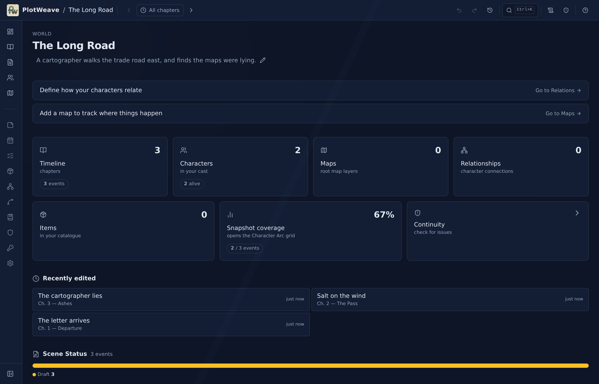
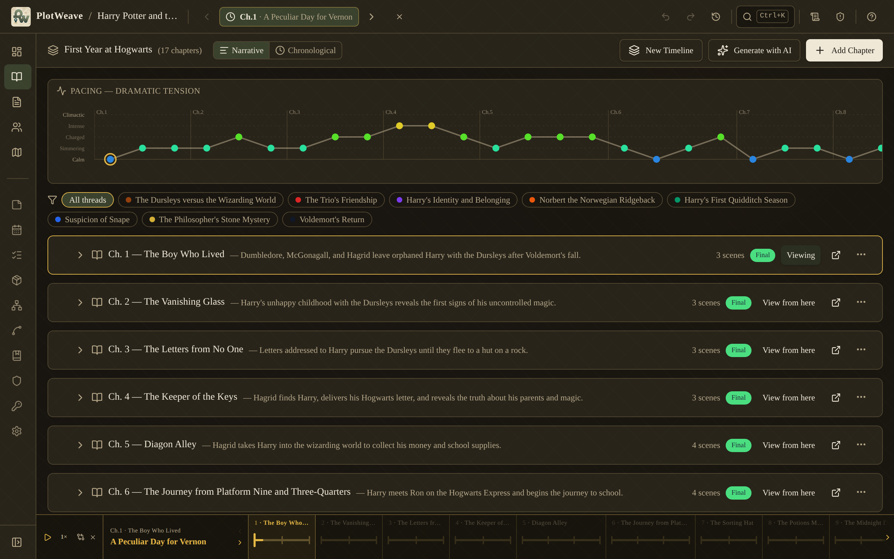
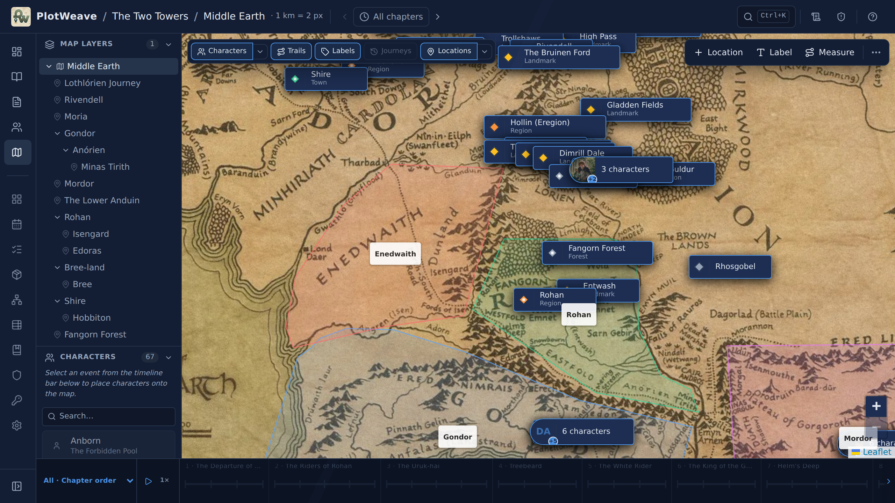
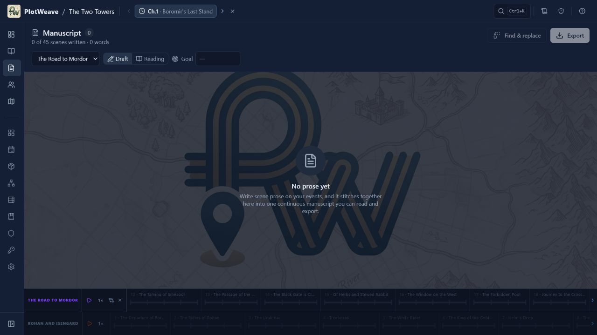
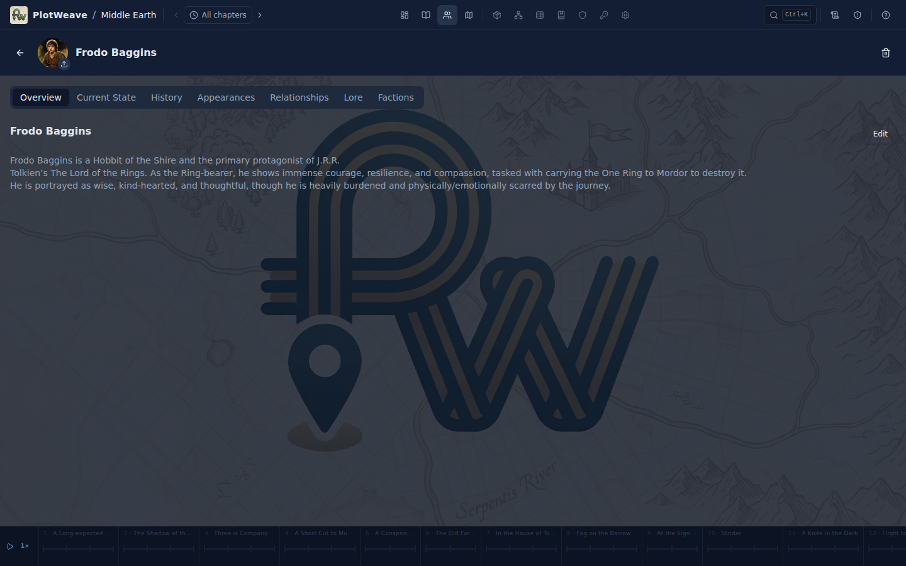
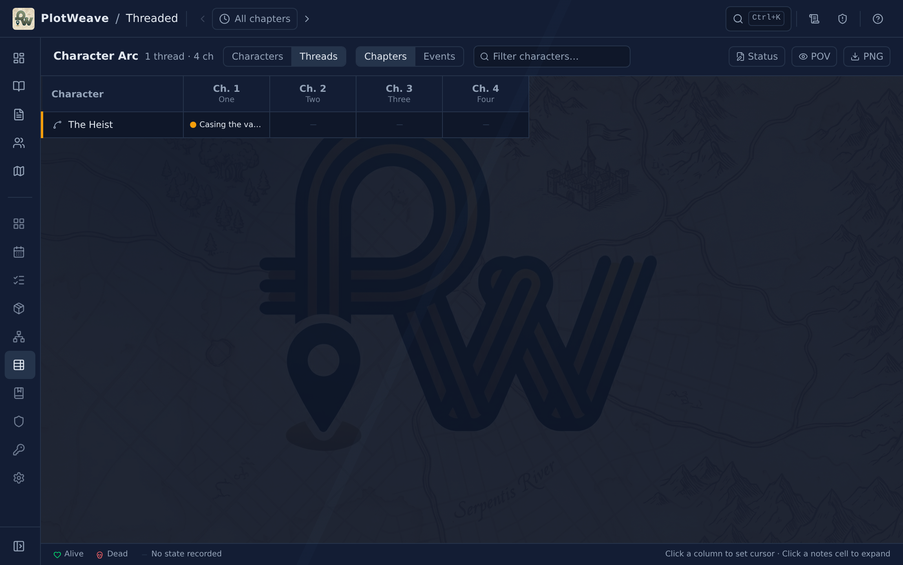

# PlotWeave

<p align="center">
  
</p>

<p align="center">
  <strong>A story bible that knows what time it is.</strong>
</p>

<p align="center">
  Track where every character is, what they carry, who they know, and what is true about your world at any moment in the story.
</p>

---

## Why PlotWeave?

Continuity becomes a memory tax as a story grows. Where was she when the letter
arrived? Who had the dagger during the ambush? Had these two characters become
enemies yet? Most tools make you answer those questions by searching or
re-reading your manuscript.

PlotWeave records story state against exact **events**. Select an event with the
time cursor and the entire workspace resolves to that moment: characters move
to their last-known locations, inventories change hands, relationships evolve,
knowledge is revealed, and maps show the relevant world state.

It is both a story bible and a companion to your manuscript—not a replacement
for Word, Scrivener, or your preferred writing environment.

## Local-first and standalone

PlotWeave works without an account or hosted backend. Worlds are stored locally
in IndexedDB and remain usable offline in the browser or desktop app.

- Export a complete world as a portable `.pwk` backup.
- Optionally split image data into a companion `.pwb` file.
- Bind a world to a local folder for automatic `.pwk` saves. That folder can be
  managed by services such as OneDrive, Dropbox, or Google Drive.
- Import both `.pwk` and `.pwb` together when restoring a split backup.

World data stays on your device unless you explicitly export it, save it to a
selected folder, link an external image, or copy content into another service.
AI-assisted workflows use copy-and-paste prompts; PlotWeave does not send your
manuscript to an AI provider itself.

---

## Screenshots

### Dashboard and planning



*See writing progress, story statistics, cast balance, plot threads, motifs,
continuity warnings, and timeline relationships at a glance.*

### Timeline and event cursor



*Organize chapters and events across one or more timelines. Selecting an event
moves the global time cursor to that exact story moment.*

### Map Explorer



*Use any image as a map, nest sub-maps and floors, place locations and
characters, draw routes and regions, measure distance, and replay movement.*

### Manuscript



*Write scene prose in context, read the assembled manuscript, track revisions,
find and replace across scenes, and export the result.*

### Characters and goals



*Track identity, portraits, event-specific state, inventory, location,
relationships, history, faction membership, lore, and goals.*

### Character Arc



*Compare character, faction, and plot-thread state across chapters or individual
events, with overlays for status, POV, goals, and factions.*

---

## What you can do

- **Scrub through story time.** The event cursor drives every time-aware view.
  Snapshots carry forward until something changes.
- **Build multiple timelines.** Model parallel plots, flashbacks, frame stories,
  and eras with independent clocks and explicit relationships.
- **Plan chapters and scenes.** Use the Timeline, Corkboard, pacing curve,
  tension ratings, event statuses, POV tracking, and Structure beat sheets.
- **Write the manuscript.** Store prose per event, read it continuously, preserve
  revision history, set writing goals, and export to common writing formats.
- **Track the cast.** Record location, inventory, status, travel mode,
  alive/dead state, relationships, faction membership, and goals.
- **Map your world.** Add nested maps, city maps, building floors, locations,
  labels, routes, regions, scale, measurement, and event-aware character paths.
- **Model relationships.** Track sentiment and strength with per-event snapshots
  and visualize the cast as a graph.
- **Manage story objects.** Follow item ownership, condition, placement, and
  movement across events and timelines.
- **Develop the world.** Maintain Lore, Factions, Knowledge, Plot Threads, and
  Motifs & Themes with event-based reveal and membership information.
- **Use an in-world calendar.** Place events on custom calendars and calculate
  character ages at the selected moment.
- **Catch continuity mistakes.** Detect impossible states, stale snapshots,
  premature knowledge, conflicting placements, and other inconsistencies.
- **Replay the story.** Animate events and character movement across maps and
  levels while notes appear in sequence.
- **Undo and inspect changes.** Use `Ctrl/⌘+Z` and Recent Changes to understand
  and reverse local edits.
- **Search everything.** Press `Ctrl/⌘+K` to find characters, events, items,
  locations, factions, lore, relationships, routes, regions, and more.
- **Import or generate a starting point.** Turn Markdown/plain text into a
  manuscript, generate structured data with copy/paste AI prompts, or start a
  sequel that carries the relevant world state forward.

### Themes that match the genre

PlotWeave includes nine visual profiles—Dark Slate, Fantasy, Sci-Fi, Cyberpunk,
Horror, Western, Action, Noir, and Romance. A world can override the global
theme so each project keeps its own atmosphere.

---

## Try or download

Use PlotWeave in the browser at
**[plotweave.netlify.app](https://plotweave.netlify.app/)**
or download the latest desktop build from the
**[Releases page](https://github.com/SirFoxworthTheThird/PlotWeave/releases)**.

Current release asset patterns:

| Platform | File |
|---|---|
| Windows | `PlotWeave-*.Setup.exe` |
| macOS (Apple silicon) | `PlotWeave-darwin-arm64-*.zip` |
| Linux (AMD64 Debian/Ubuntu) | `plotweave_*_amd64.deb` |

The browser and desktop versions use the same local-first data model. Browser
storage belongs to that browser profile, so export regularly or configure a
sync folder for additional backups.

---

## Quick start

1. **Create a blank world**, import a manuscript, generate a world from a
   synopsis, or import an existing `.pwk` backup.
2. **Create a timeline, chapter, and event.** Events are the moments against
   which PlotWeave records state.
3. **Add characters and locations**, then save character state at the selected
   event.
4. **Add later events** and record only what changes. PlotWeave carries earlier
   snapshots forward automatically.
5. **Write scene prose**, connect plot threads, add world knowledge, and use the
   Continuity Checker as the story grows.
6. **Export regularly** as `.pwk`, or `.pwk` + `.pwb` when using split image
   backups.

---

## Documentation

The **[User Guide](docs/GUIDE.md)** is a screenshot-by-screenshot walkthrough of
the time cursor, timelines, manuscript, maps, characters, planning tools,
calendar, continuity system, folder sync, export, and every other major feature.
Contextual help is also available inside the app from the `?` button.

---

## Tech stack

| Concern | Library |
|---|---|
| Desktop shell | Electron 41 + Electron Forge |
| Framework | React 19 + TypeScript |
| Build tool | Vite 8 |
| Local database | Dexie.js 4 (IndexedDB) |
| UI state | Zustand 5 |
| Routing | React Router 7 |
| Maps | Leaflet + React Leaflet (`CRS.Simple`) |
| Relationship graph | React Flow 11 |
| Styling | Tailwind CSS 4 |
| Components | Radix UI + Lucide React |
| Testing | Vitest 4 + Playwright |

---

## Development

```bash
npm install

npm run dev              # browser development server
npm run electron:dev     # Vite + Electron development
npm run preview          # preview the production web build

npm run lint             # ESLint
npm test                 # Vitest suite
npm run test:watch       # Vitest watch mode
npm run test:coverage    # Vitest coverage
npm run test:e2e         # Playwright end-to-end suite
npm run test:e2e:ui      # Playwright interactive runner

npm run build            # type-check + production web build
npm run electron:package # package the desktop app
npm run electron:make    # create installers for the current platform
```

`@` is aliased to `src/`.

## Project layout

```text
src/
  components/  # application shell, navigation, time cursor, and shared UI
  db/          # Dexie schema, migrations, hooks, and the operation journal
  features/    # timeline, manuscript, maps, characters, history, lore, etc.
  lib/         # import/export, sync, continuity, analysis, and shared utilities
  store/       # persisted application and cursor state
  types/       # domain entity and operation interfaces

docs/          # user guide and maintained screenshots
e2e/           # Playwright end-to-end tests
electron/      # desktop entry point and packaging integration
example/       # importable example worlds
```

Book examples follow the maintained [example authoring checklist](docs/EXAMPLE_AUTHORING_CHECKLIST.md). Its automated guardrails run as part of the Vitest suite and cover the recurring data-quality failures that are not purely visual.

---

## License

Released under the [MIT License](LICENSE).

---

<sub>Built conversationally with [Claude Code](https://claude.com/claude-code).</sub>
