# PlotWeave — User Guide

**PlotWeave** is a local-first story bible for fiction writers. It tracks your
characters, timeline, maps, items, relationships, lore, and continuity as your
story evolves, stitches your scene prose into a manuscript, can build a whole
world from a draft or an AI assistant, and can carry a series forward into a
sequel — all stored privately in your browser (IndexedDB), with no account and
no backend. You can run it in the browser or as a desktop app.

This guide walks through every part of the app. All screenshots use the bundled
example world, *Middle Earth* (a Lord of the Rings sample you can import to
explore).

---

## Table of contents

1. [Core concept: the time cursor](#core-concept-the-time-cursor)
2. [Getting started — the world selector](#getting-started--the-world-selector)
3. [Import a manuscript](#import-a-manuscript)
4. [Generate a world from AI](#generate-a-world-from-ai)
5. [Start a sequel](#start-a-sequel)
6. [The world dashboard](#the-world-dashboard)
7. [Timeline & events](#timeline--events)
8. [Chapter detail](#chapter-detail)
9. [Corkboard](#corkboard)
10. [Manuscript](#manuscript)
11. [Characters](#characters)
12. [Cast Balance](#cast-balance)
13. [Plot Threads](#plot-threads)
14. [Motifs & Themes](#motifs--themes)
15. [Structure board](#structure-board)
16. [Maps](#maps)
17. [Items](#items)
18. [Relationships](#relationships)
19. [Character Arc grid](#character-arc-grid)
20. [Lore](#lore)
21. [Factions](#factions)
22. [Knowledge](#knowledge)
23. [Search](#search)
24. [Writer's Brief](#writers-brief)
25. [Calendar & character ages](#calendar--character-ages)
26. [Continuity Checker](#continuity-checker)
27. [World settings & export](#world-settings--export)
28. [Help](#help)

---

## Core concept: the time cursor

Everything in PlotWeave is read *relative to an event*. Events are the true units
of story time; chapters group those events for structure and reading order. The
pill next to the world name — labelled **All chapters** until you choose a moment
— and the event bar along the bottom are two views of the same **time cursor**.
Use either one to move event by event. The whole app then answers *"what is true
at this exact moment?"*: where each character is, what they're carrying, who's
alive, which locations are destroyed, and how relationships stand.

State changes are stored as explicit **snapshots** tied to events. When an entity
has no snapshot at the selected event, PlotWeave carries forward its most recent
state from earlier in that timeline. This is a delta model: record only what
changes rather than entering every character, item, location, and relationship
again at every scene. New chapters are seeded from the end of the preceding
chapter on the same timeline.

Changing the cursor never edits the story; it only changes the moment you're
viewing. You'll see the cursor on nearly every screen in this guide.

---

## Getting started — the world selector

The first screen lists your worlds. From here you can **create a new world**,
**generate one from AI**, or **import** an existing `.pwk` file (PlotWeave's
export format). If your export was split into data + images, select both the
`.pwk` and its `.pwb` images file together.

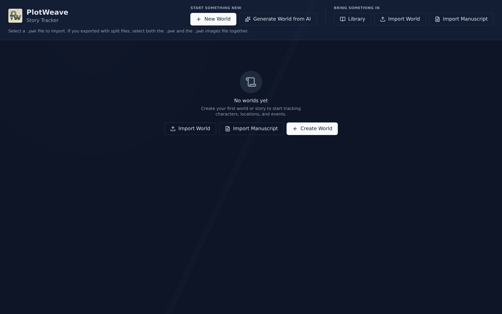

Once you have worlds, each appears as a card with its name, last-edited date, and
description. Click a card to open it; the ⋯ menu on each card exports or deletes
that world.

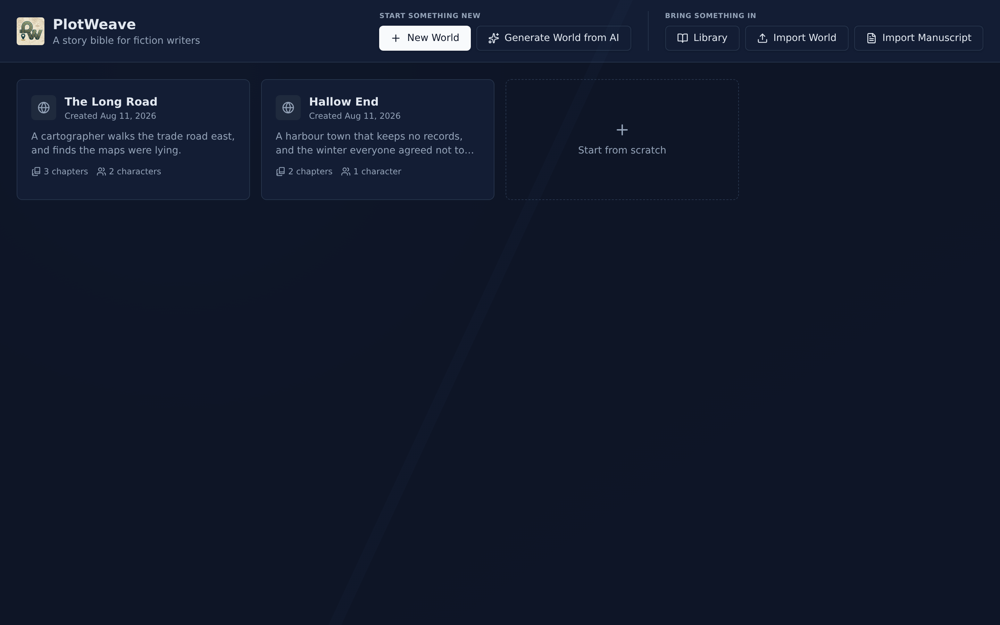

### Set up a blank world

When you create a blank world, PlotWeave opens a four-step setup guide. It helps
you create the first timeline and event, add a main character, place that
character at the opening moment, and then continue to the Timeline. Each optional
step has **Skip** so you can leave the guide and build the world in any order.

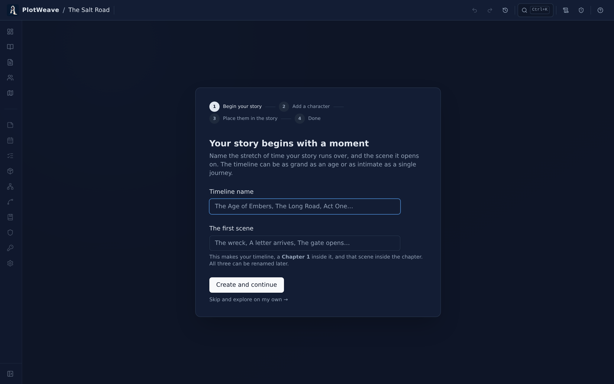

---

## Import a manuscript

Already have a draft? **Import Manuscript** (on the world selector) turns it into a
new world in one step, so you don't have to re-enter every chapter by hand. It's
the mirror image of the manuscript *export* — bring a draft in, and everything
else (word counts, continuity, pacing, the reading view) works on it immediately.

Choose a `.md` or `.txt` file, or just paste your text. PlotWeave parses it with
a few predictable rules:

- **Chapters** — a Markdown `#`/`##` heading, or a line that starts with
  *Chapter*, *Prologue*, *Epilogue*, or *Part*, begins a new chapter. A `Chapter 7:
  The Reckoning` heading keeps *The Reckoning* as the title.
- **Book title** — if the file opens with a single `#` heading (your title) followed
  by a chapter, that heading becomes the world's name rather than a chapter.
- **Scenes** — a line of only symbols — `* * *`, `***`, `---`, a lone `#` — splits a
  chapter into scenes. Paragraph breaks inside a scene are preserved. Prose before
  the first heading becomes an untitled opening chapter.

A live **preview** shows exactly how it will land — chapter, scene, and word
counts, plus the chapter list — before anything is created. The world name is
prefilled from a detected title (edit it if you like), and **Import** drops you
straight into the new world.

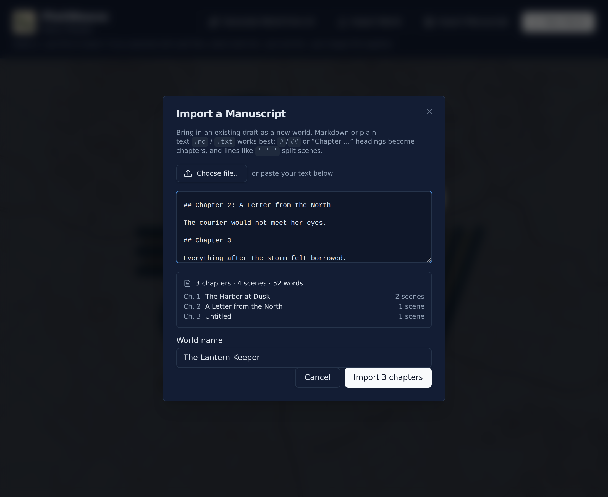

Each parsed scene becomes an event with its prose attached, so the imported draft
flows straight into the Manuscript view and reads back as one continuous document.
(Import handles Markdown and plain text today; `.docx` is planned.)

---

## Generate a world from AI

If your story lives in your head or in a synopsis rather than a finished draft,
**Generate World from AI** builds the whole structure — characters, factions,
relationships, chapters, events, and who-knows-what — from a story document, using
any AI assistant (ChatGPT, Claude, Gemini…).

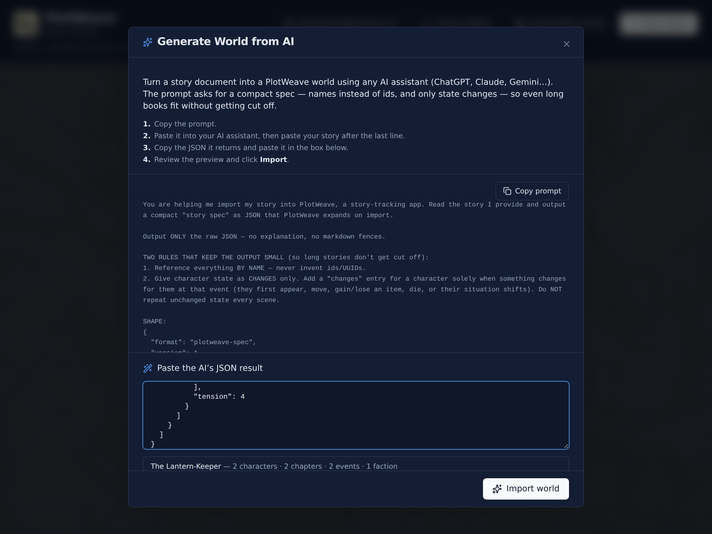

1. **Copy the prompt** from the dialog and paste it into your AI assistant,
   followed by your story text.
2. The assistant replies with a compact JSON **story spec**.
3. **Paste that JSON** back into the box in the dialog. A live preview shows what
   it found — character, chapter, event, and faction counts.
4. Click **Import world** and you land in the finished world.

The prompt deliberately asks for a *compact* spec — entities are referenced by
**name** rather than long ids, and a character's state is recorded only when it
**changes** (they appear, move, gain or lose an item, or die). That keeps the
AI's output small, so even a full novel fits in one response without getting cut
off — PlotWeave expands the compact spec back into the full model on import, so
nothing is lost.

> **Tip:** you don't need a polished manuscript. A detailed synopsis, an outline,
> or a wiki-style summary all work — the more detail you give, the richer the
> generated world.

---

## Start a sequel

Writing a series? **Start a sequel** builds book two (or three…) from an existing
world, so you don't rebuild your cast and setting from scratch. Find it on a world
card's menu (the ▾ next to Export) on the world selector.

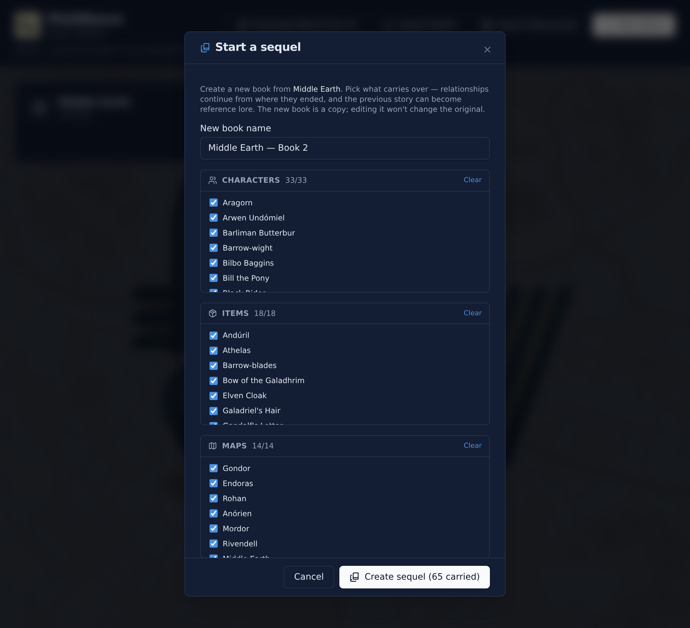

A wizard lets you choose exactly what carries over — everything is selected by
default, and you tick off what doesn't return:

- **Characters, factions, items, and maps** — pick which come along. Each is
  copied with a fresh identity into the new book (portraits and map images
  included).
- **Relationships continue** — a carried-over relationship starts book two in the
  state it *ended* book one (its final label, sentiment, and strength), and each
  character arrives at their book-one ending status (alive or dead).
- **“Previously…” lore** — optionally turn book one's chapters into a recap: one
  lore page per chapter, grouped in a *Previously — {book one}* category. Your
  existing world-building lore can carry forward too.
- **Seed an opening chapter** — optionally start book two with an opening chapter
  in which every returning character is already placed at their book-one ending
  location and inventory, so continuity is wired from page one.

The sequel is a **copy**: it's a fully independent world, so editing it never
changes the original. Book one's chapters, events, and scene prose are *not*
copied — book two is a fresh narrative that begins where the last one left off.

---

## The world dashboard

Opening a world lands you on its dashboard — a bird's-eye view of the whole
project. Stat tiles summarise the timeline, cast, maps, relationships, items,
snapshot coverage, and continuity status. Below them are recent events, scene
status, writing progress, and analytics panels (Cast Balance, Plot Threads, and
Motifs & Themes, covered later). Worlds with linked timelines also show a
**Timeline Links** summary.

The tiles are links — click **Timeline**, **Characters**, **Maps**, or any other
tile to jump straight to that area.

### Getting around

Every screen in a world shares a **left navigation rail**. By default it's a slim
strip of icons to keep your workspace wide; **hover** it to slide out the full
labels, or click the **pin** at the bottom to keep it expanded. The everyday
screens (Dashboard, Timeline, Manuscript, Characters, Maps) sit above a **More**
divider, with the rest below.

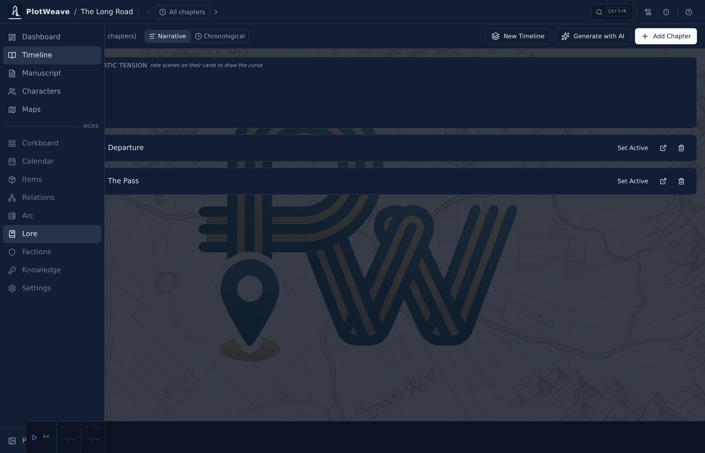

On a phone the rail is replaced by a **☰ menu** in the top bar. The top bar
itself keeps the world name, the [time cursor](#core-concept-the-time-cursor),
search (**Ctrl/⌘ K**), and the Writer's Brief, Continuity, and Help tools.

### Writing progress

As you write scene prose (in the Manuscript view), PlotWeave keeps a lightweight
per-day log of the words you add or cut. The **Writing Progress** panel on the
dashboard turns that into an at-a-glance readout:

- **Total words** across the whole manuscript.
- **Words today** — the net change since midnight (green when you've added).
- **Day streak** — consecutive days you've written; a blank day today doesn't
  break a run you're still in the middle of.
- A **daily session goal** — set a per-day word goal and a ring fills as you
  hit it today.
- A **burndown bar** against your book **word target** (set it under
  *Manuscript* in [World settings](#world-settings--export)), showing percent
  complete and words to go.
- A **14-day strip** of daily output so you can see your recent momentum.

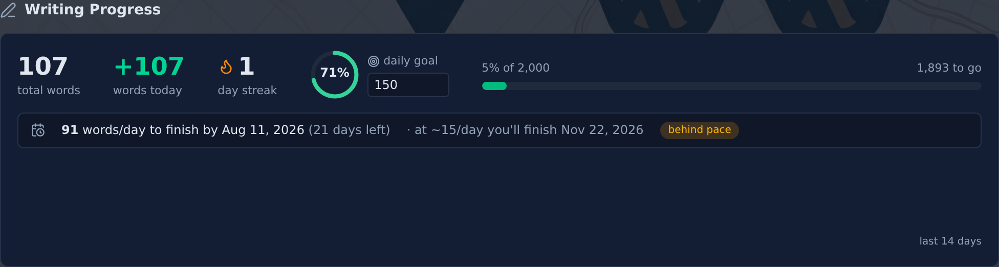

### Deadline & projection

Give the book a **deadline** (also under *Manuscript* in World settings) and the
panel adds a forecast: the **words/day** you'd need to finish on time, and — from
your recent pace — a **projected finish date** with an **on track** / **behind
pace** badge. It's an honest read on whether your current rhythm will get you
there.

The log, target, and deadline all travel with the world through export/import, so
your streak and history survive a backup or a move to another device.

---

## Timeline & events

The Timeline is the spine of your story: a list of chapters, each holding an
ordered set of **events** (scenes/beats). A **pacing curve** across the top plots
dramatic tension chapter by chapter once you rate scenes, so you can see the
shape of your story at a glance.

- **Narrative vs. Chronological** — toggle between the reading order and the
  in-world order (useful when you use flashbacks or in-world dates).
- **Add Chapter**, **New Timeline** (for alternate/parallel timelines), and
  **Generate with AI** all live in the header.
- Click an event to move the time cursor to that exact moment. Each chapter row
  also has an **open** button for its detail page, and chapters can be dragged to
  reorder the narrative.
- Select events with their checkboxes; **Shift+click** selects a range. The bulk
  toolbar can move the selection to another chapter, add a tag, or delete it.
- The chapter bar at the bottom of the screen also lets you **play the story**
  and **Compare chapters** — a diff of exactly what changed between any two points
  (who moved, gained or lost items, died, or shifted relationships).

### Multiple timelines and timeline relationships

Creating another timeline adds a tab at the top of the Timeline page. Use
**Timeline Relationships** to describe how two timelines connect:

- **Frame Narrative** — an outer timeline tells or contains the inner story.
- **Historical Echo** — the same places or patterns recur in different eras.
- **Embedded Fiction** — a story, play, prophecy, or document inside the world
  constitutes another timeline.
- **Alternate** — the timelines branch from similar conditions toward different
  outcomes.

Choose an **Outer / Source** and **Inner / Target** timeline, then add optional
character, location, or document anchors. Frame narratives can also use **sync
points**: pair an event in the inner story with one in the outer story so playback
keeps the framing moment aligned.

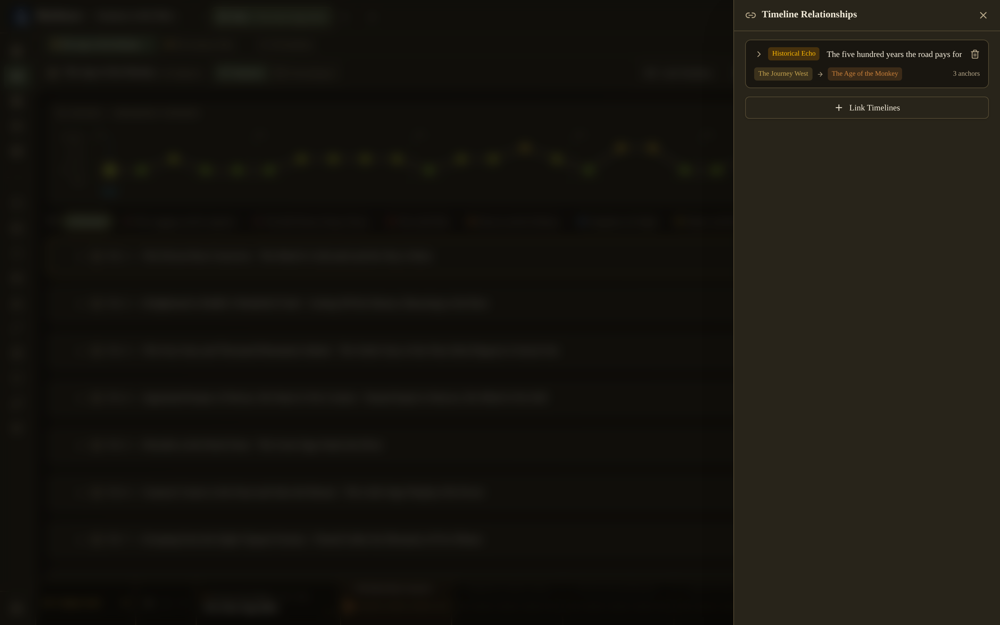

**Frame narratives** get a special bottom cursor: two stacked tracks (outer and
inner). Click either track to make it active; playback follows that track while
keeping the linked one available for context, and a ghost cursor line marks the
corresponding moment on the other track.

Every **other multi-timeline world** uses a single-height bottom bar with a
**scope selector** on its left. Choose one timeline to scrub it on its own, or
pick **All · Chapter order** / **All · Chronological** to merge every timeline
into one strip — each chapter run tinted with its timeline's colour, and the
active event's panel showing which storyline it belongs to. The scope is
remembered between sessions.

**Chapter order** follows chapter numbers across all timelines, so a book
numbered straight through (e.g. book III = ch. 1–11, book IV = ch. 12–21) reads
in order from chapter 1. **Chronological** order instead follows the in-world day
each scene happens.

**Play** works in every scope, always on the map. On a single timeline it's the
usual animated run (characters move along their trails). In a merged view it
plays through the whole sequence and the **map follows each event's own
timeline** — as the cursor crosses from one storyline into another, the map
switches to that timeline's cast and animates their movement. Chronological order
braids the storylines, so the map alternates between them as their scenes
interleave.

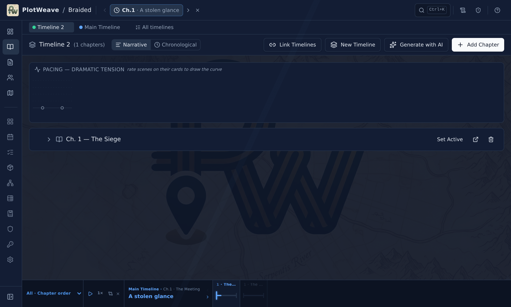

#### All timelines — the real sequence across storylines

Each timeline numbers its chapters on its own and keeps its own in-world clock,
so switching between tabs never shows how the storylines actually interleave.
The **All timelines** tab (it appears alongside your timeline tabs once you have
more than one) merges every timeline into a single sequence, with the same two
orders as the bottom bar: **Chapter order** (reading order, following chapter
numbers across all timelines) or **Chronological** (every scene ordered by the
in-world day it happens; each timeline's clock starts at day 0, or at the
**start day** you give it in [World settings](#world-settings--export) for
multi-era stories). The toggle
here and the bottom bar's scope selector are one setting — change either and
both follow, and your choice is remembered between sessions. Each row is tagged
with a coloured dot, its timeline name, and its chapter, so you can read the
true order of events across parallel POVs or braided plots at a glance. Click
any row to move the time cursor to that moment.

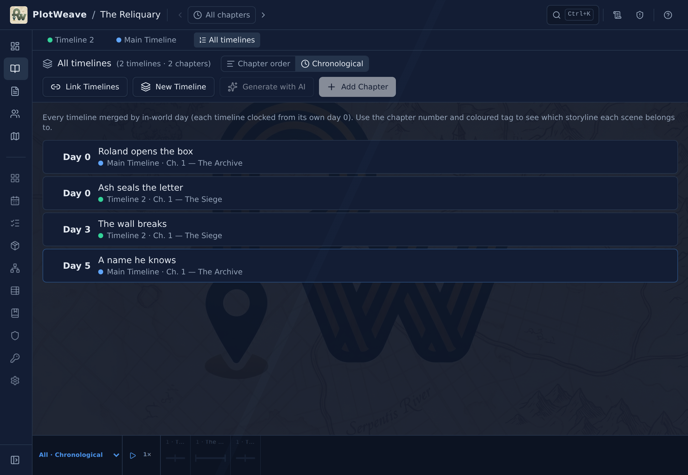

### Chapter detail

Opening a chapter shows its events in order, each with the characters involved,
location, tags, and draft/written status. The right side holds a live
**Character States** panel (where everyone is at the selected event), a
**Relationship States** summary, and a freeform **Writer's Notes** field that
auto-saves.

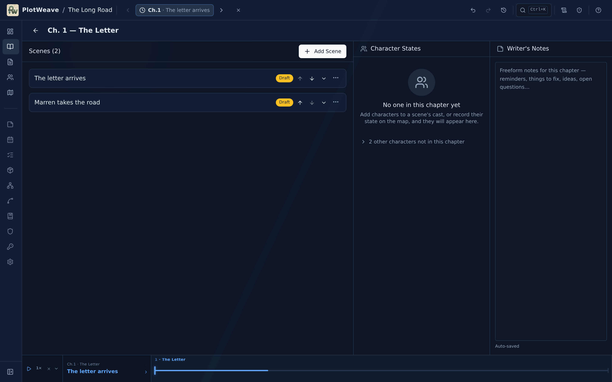

**Generate / Update Chapter with AI.** From a chapter you can hand your scene
text to an AI assistant (via a copy-paste prompt, like the world generator) and
have it fill in the events, character states, and a dramatic-**tension** rating
for each event — the ratings feed the pacing curve on the Timeline. *Generate*
drafts a new chapter; *Update* re-derives an existing one from its prose.

---

## Corkboard

The **Corkboard** is an index-card view of your whole story — the classic way to
see structure at a glance and shuffle it. Each chapter is a column; each scene
(event) is a card showing its title, synopsis, POV character, and **status**
(Idea → Outline → Draft → Revised → Final).

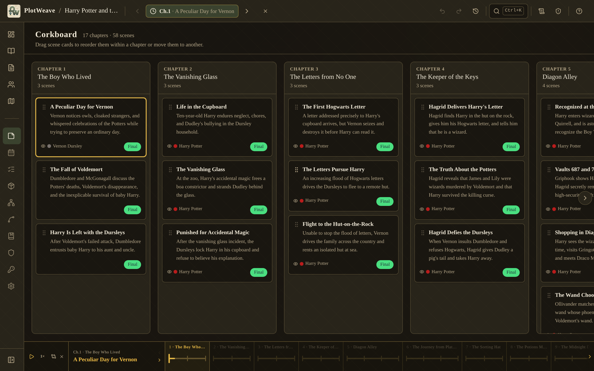

- **Drag a card** to reorder scenes within a chapter, or drop it into another
  chapter's column to move it there — the timeline order updates to match.
- **Change a scene's status** right on the card with the status pill.
- **Click a card's title** to jump to that scene in the chapter detail with the
  time cursor set to it.

It's the same events as the Timeline, shown as a board — reorder here or there
and both stay in sync.

---

## Manuscript

The **Manuscript** view stitches every scene's prose into one continuous
document, in reading order, so you can read and export your book without leaving
PlotWeave. Write a scene's prose on its event, and it appears here automatically.

- **Draft vs. Reading** — Draft shows per-scene and per-chapter word counts, scene
  labels, and links back to each event; Reading hides the scaffolding for a clean
  read-through of only the written scenes.
- **Word goals** — set a target for the whole manuscript (in the header) and a
  per-chapter goal (in Draft mode); a progress bar tracks words against each.
  Per-chapter goals are saved with the chapter.
- **Export** — download or copy the manuscript as Markdown, HTML, or plain text,
  or **compile a finished book file**: **Word (.docx)** or **EPUB**. The book
  formats build a title page (with an optional author), start each chapter on its
  own heading, and separate scenes — EPUB also gets a linked table of contents.
  Both are generated right in the browser, so nothing leaves your device.

Empty scenes are flagged with a "write this scene" link, so the manuscript
doubles as a checklist of what's left to draft.

### Find & replace

The **Find & replace** button (in the Manuscript header) searches across *every
scene's prose* at once — for renaming a term or fixing a recurring tic without
opening each scene. Type a phrase to see every scene that contains it, with a
match count and a highlighted preview.

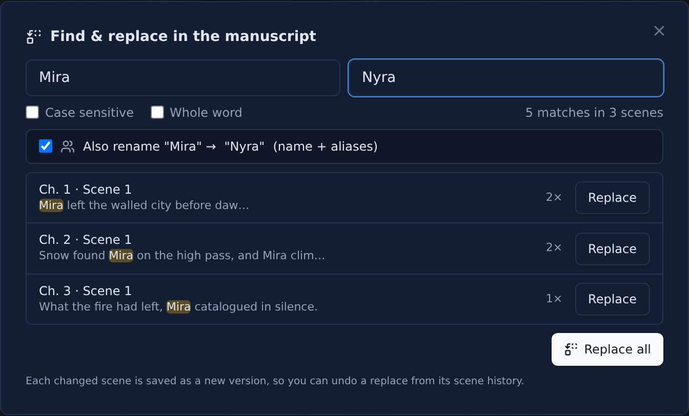

- **Case sensitive** and **whole word** toggles refine the match.
- **Replace** one scene at a time, or **Replace all** across the manuscript.
- **Character-rename aware** — when your search exactly matches a character's
  name, PlotWeave offers to rename that character too (its name *and* aliases),
  so the cast list stays in sync with the prose.

Every scene changed by a replace is saved as a new version, so you can undo it
from that scene's [history](#scene-history).

### Scene history

Every scene keeps a **revision history**. As you revise a scene's prose,
PlotWeave automatically saves earlier drafts (grouped so a burst of edits becomes
one snapshot, and capped to the most recent 20). A **History** link appears above
the scene draft once there are saved versions.

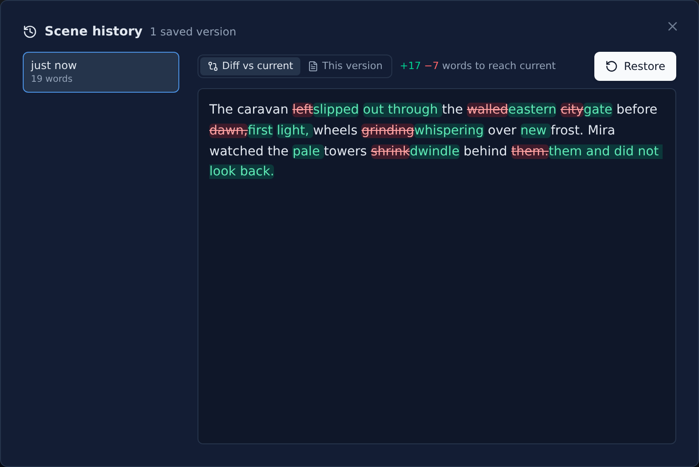

Open it to browse past versions with their timestamp and word count, **diff** any
version against the current prose (added words in green, removed in red), and
**restore** one. Restoring is non-destructive — the current draft is saved as a
new version first, so you can always undo it. The full history travels with the
world through export/import.

### Focus mode

Above the scene draft, **Focus** opens a full-screen, distraction-free writing
surface for that scene — no chrome, just your prose in a centered column. The
caret stays vertically centered as you type (typewriter scrolling), a live
**word count** and **words this session** sit in the slim header, and if you've
set a [daily goal](#writing-progress) a thin bar at the bottom fills toward it.

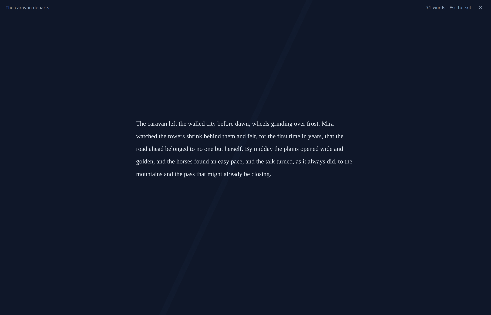

It autosaves as you write (so scene history and the writing log keep working);
press **Esc** or click the ✕ to drop back to the event.

---

## Characters

The Characters roster is your cast list, with portraits and a search box. The
count badge tracks how many characters you're following.

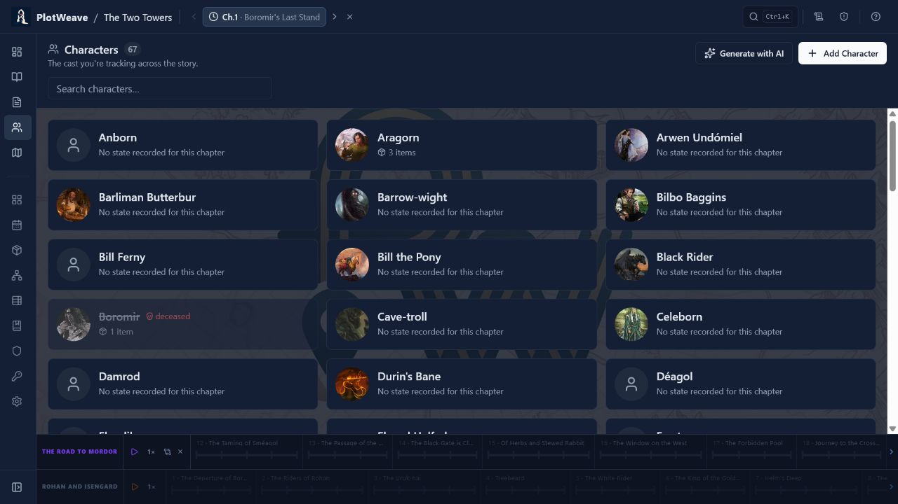

### Generate characters with AI

Building a large cast by hand is slow. **Generate with AI** (next to *Add
Character*) does it for you with any AI assistant. It works the same way as
[Generate a world from AI](#generate-a-world-from-ai), but scoped to one
section and added to the **world you're already in** — no new world is created:

1. Click **Generate with AI** and **Copy prompt**.
2. Paste it into ChatGPT, Claude, Gemini, or similar, then describe your story
   (or just list the characters you want) after the last line.
3. Paste the JSON it returns into the box. A preview tells you how many
   characters it will import.
4. Click **Add characters**. New names are created; a name that **already
   exists is updated in place** — the fields the AI supplies overwrite the
   current values, while anything it leaves out is untouched. So you can run it
   again to top up your cast *and* to flesh out characters you already made,
   without ever creating duplicates. The result banner reports how many were
   added, updated, and left unchanged.

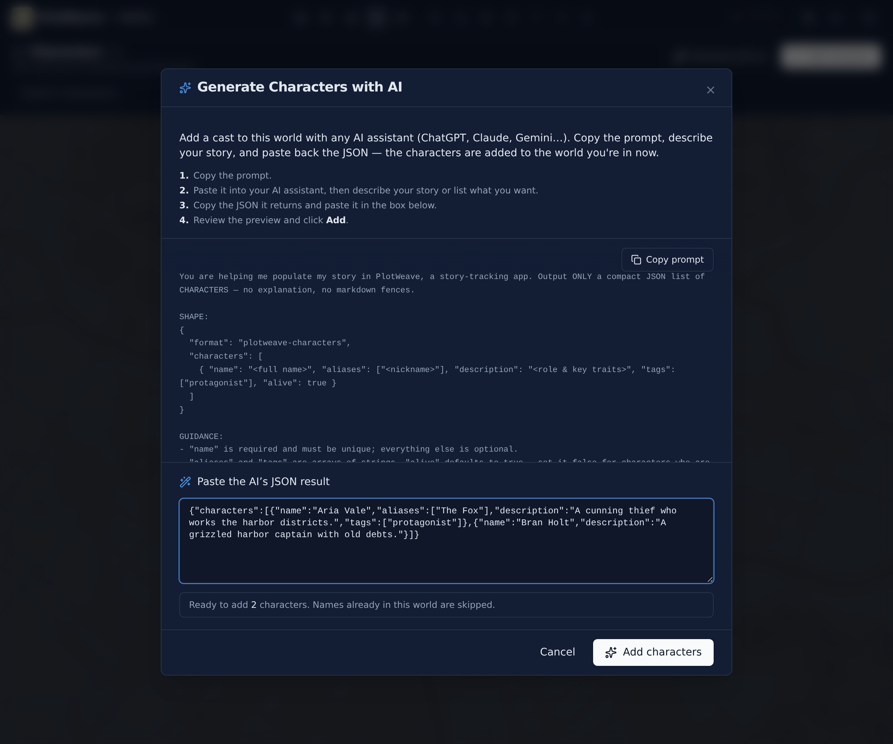

> **Images: upload or link.** For a character's portrait — and likewise for item
> images and maps — you can either **upload** a file or **link an image URL**
> (the ⬆ upload and 🔗 link controls sit on the image). Linked images aren't
> stored in your browser, so they need an internet connection to display and can
> break if the source goes away; uploads are self-contained.

Opening a character gives you a tabbed profile:

- **Overview** — biography, aliases, portrait, map/Arc colour, and an optional
  birth date when the world has a calendar.
- **Current State** — location, inventory notes, alive status, and travel mode
  *at the current event*.
- **History** — how their state changed event by event, including carried-forward
  states.
- **Appearances** — every event they're in.
- **Goals** — their inner life (see below).
- **Relationships**, **Lore**, and **Factions** — their connections and
  affiliations.

### Goals & motivations

The **Goals** tab tracks the inner life behind a character's scenes, along the
four classic axes:

- **Want** — the conscious objective they're chasing.
- **Need** — what they actually require, often at odds with the want.
- **Fear** — what they're avoiding.
- **Flaw** — the trait that keeps getting in their way.

Each goal can be **scoped in time** — *From* an event *until* another — so a want
they pick up in chapter three and abandon in chapter nine is recorded as exactly
that. Leave either end open for a drive they carry from the start, or to the end.
Goals that aren't held at the current time cursor stay listed but dimmed and
marked *inactive here*, so the whole arc is visible while you edit.

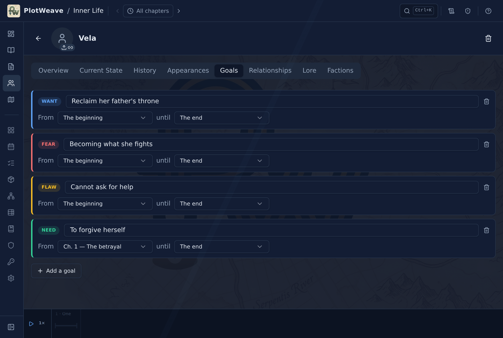

Goals surface where you're writing, not just where you set them:

- The **[Writer's Brief](#writers-brief)** lists each present character's active
  goals alongside their location and inventory, so the moment's motivations are
  in front of you.
- The **[Character Arc grid](#character-arc-grid)** has a **Goals** overlay that
  prints them under each character's name, and every row's name carries them as
  a tooltip.

---

## Cast Balance

Found on the dashboard, **Cast Balance** answers *"who is actually carrying this
book?"* Each character gets a word-weighted **screen-time** bar (measured from
your scene prose), a **presence strip** showing which chapters they appear in,
and automatic flags when someone important **drops out for a long stretch** or
goes quiet late in the story.

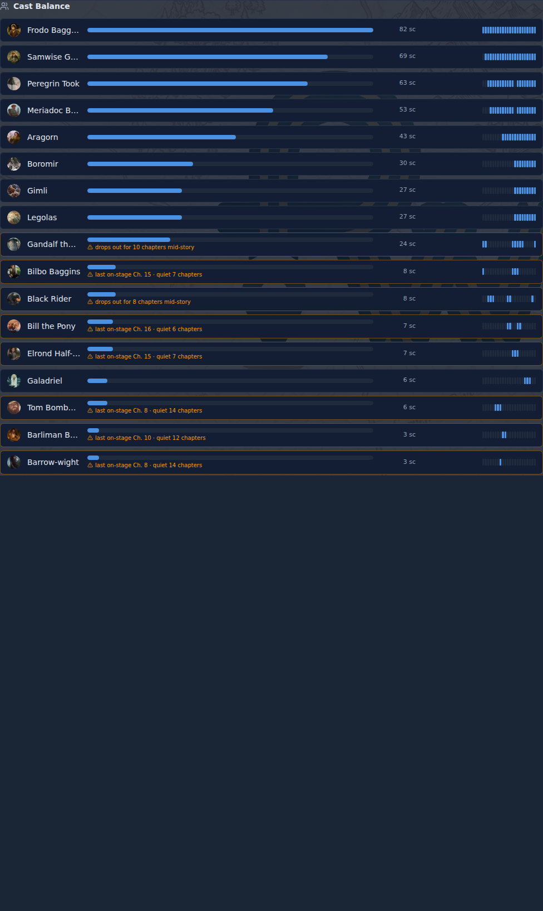

This makes it easy to spot a protagonist who vanishes for ten chapters or a
side character who's quietly taken over.

---

## Plot Threads

**Plot Threads** track subplots. Define named threads (e.g. *The Ring's Journey*,
*Pursuit of the Nazgûl*), give each a colour, and tag events with the threads
they advance. The dashboard widget then draws a **cadence strip** per thread
across your chapters and flags trouble:

- **"goes quiet for N chapters"** — a thread that disappears mid-story.
- **"dangling"** — a thread that was raised and then never resolved.

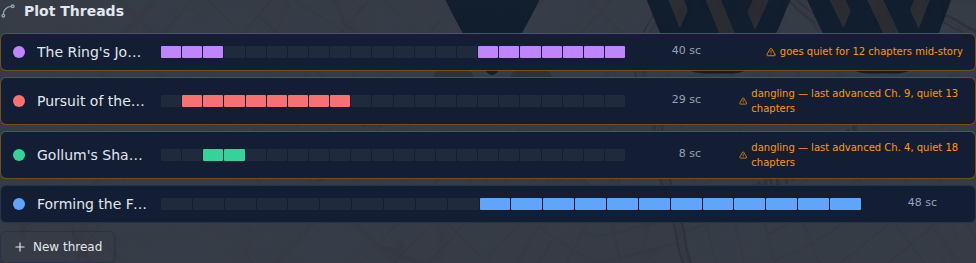

Tag a thread onto an event from the event's card; create threads inline with the
**+ New thread** button.

### Filtering the timeline to one thread

Once you have threads, the **Timeline** page (in Narrative view) shows a filter
row of thread pills above the chapters. Click a thread to focus the timeline on
that subplot: only chapters that advance it are listed, each expanded to show
just the scenes tagged with it, so you can read a subplot end-to-end without the
surrounding story. Click **All threads** to clear the filter.

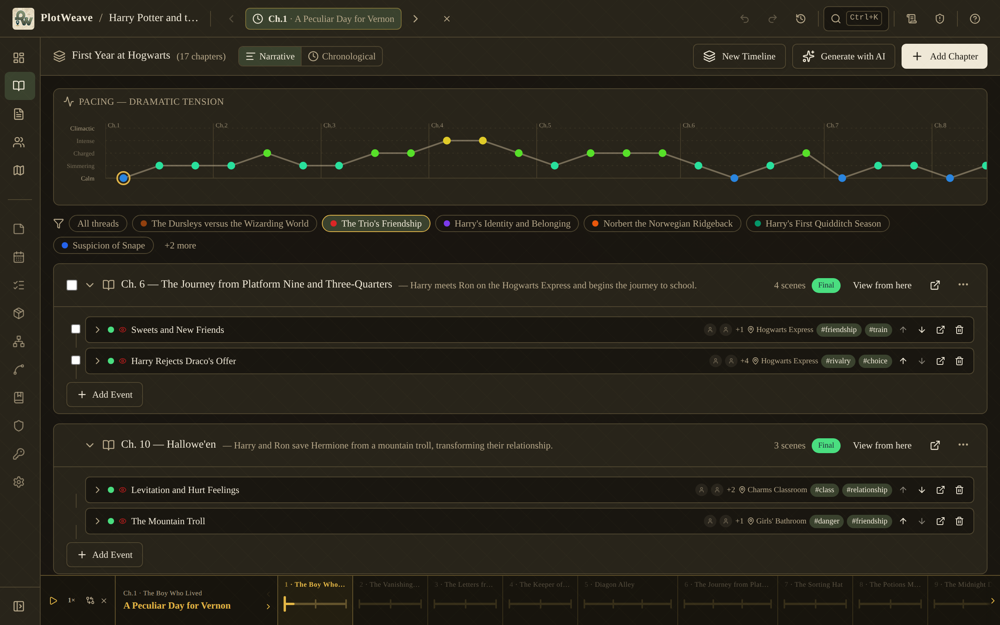

### A lane per thread in the Arc grid

The [Character Arc grid](#character-arc-grid) has a **Threads** row type: one
lane per thread across your chapters (or events), each cell naming the scene
that carries it. Where a lane goes blank, the subplot is off-stage — the fastest
way to see a thread's rhythm across the whole book.

### Threads in the Continuity Checker

The same cadence analysis is reported as findings under **Plot threads** in the
[Continuity Checker](#continuity-checker), so they're actionable rather than
just visible:

- **left dangling** — raised, then quiet for the last three chapters or more.
- **goes quiet mid-story** — a run of three or more chapters with no beat.
- **has no scenes** — a thread that exists but was never tagged onto an event.

Each finding links to the chapter where the thread was last (or first) seen, and
can be suppressed with a note like any other continuity issue.

---

## Motifs & Themes

**Motifs & Themes** works exactly like Plot Threads, but for symbolism rather
than plot — recurring images, symbols, and themes such as *mirrors*, *the colour
red*, or *exile*. Define named motifs on the dashboard, give each a colour, and
tag the scenes that carry them from the event card.

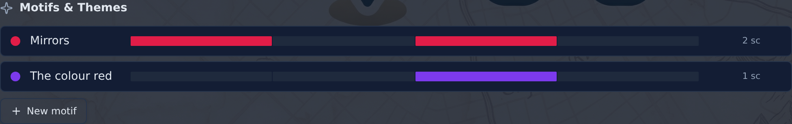

The dashboard draws a **cadence strip** per motif across your chapters so you can
see its rhythm at a glance, and flags where a motif loses momentum:

- **"vanishes for N chapters"** — a motif that drops out of the middle of the book.
- **"fades out"** — a motif introduced early and then never seen again.

Use it to check that a theme you care about is woven through the whole story,
not just raised once and forgotten.

---

## Structure board

The **Structure** board checks your story against a **beat sheet**. Pick a
template — **Three-Act**, **Save the Cat**, or **Hero's Journey** — and each of
its beats appears as a slot, in order and tinted by act.

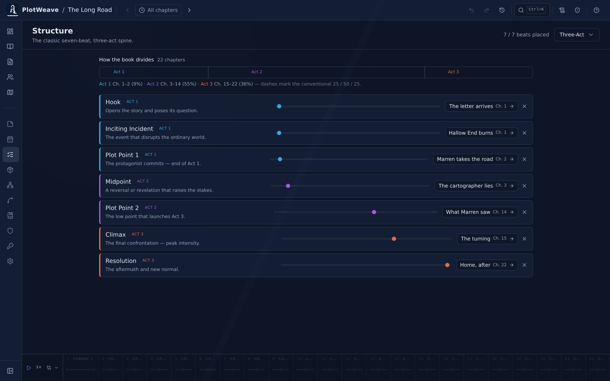

- **Assign a scene** to a beat from its "+ Assign a scene…" picker; the slot then
  shows that scene (click it to jump to the event in the timeline).
- A **X / N beats placed** counter tells you how much of the structure is filled,
  so **gaps** — a missing midpoint, no clear climax — stand out.
- A beat is flagged **out of order** when its scene falls earlier in the story
  than a later beat's scene, catching a structure that's been shuffled.

Switching templates keeps your tags — a scene tagged with a Three-Act beat simply
won't fill a Save-the-Cat slot until you assign it there, so you can commit to one
framework at a time. (You can also set a scene's beat from its card on the
Timeline.)

---

## Maps

PlotWeave renders custom, hand-drawn fantasy maps (pixel-coordinate images, not
geographic tiles). Upload a map image or **link one by URL** in the upload
dialog, place **location markers**, group them into **layers** and **sub-maps**
(drill into a city from the world map), draw **regions** and **routes**, and set
a **map scale** to unlock distance measurement. (A *linked* map may not be
included in *Export map as PNG*, since browsers restrict drawing cross-origin
images to a canvas — uploaded maps always export.)

The map's own controls **float over the canvas** rather than sitting in header
rows above it, so the map itself runs from the top of the view to the chapter
bar. Top-left is the map's name and scale, with the **Show** chips beneath it —
toggles for characters, trails, labels, journeys, and locations (the chevrons
narrow those to particular characters or location types). Top-right holds the
two commands you reach for while working a map, **+ Location** and **Label**,
plus a **⋯** menu for everything you set up once or use occasionally: map
scale, add level, replace image, export as PNG, and the AI tools. Zoom sits in
the bottom-right corner of the canvas.

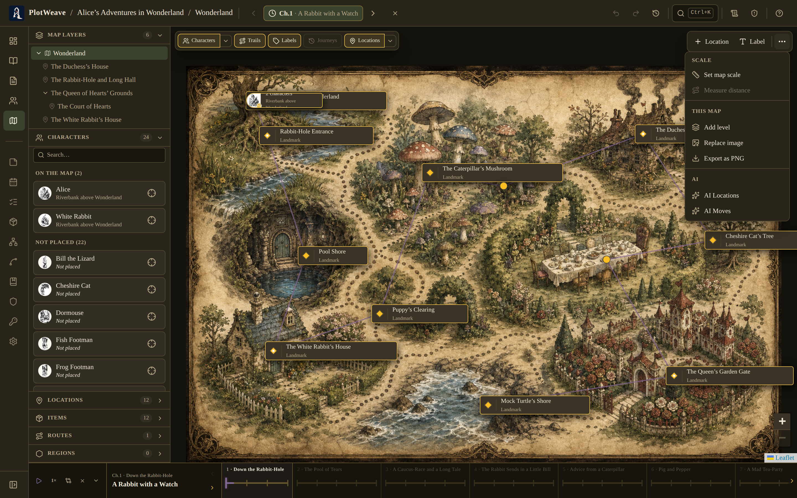

The left sidebar lists map layers and locations. In the **Map Layers** tree
you can **drag a map onto another** to nest it inside (re-parent it), or drop it
on the *"top level"* zone to un-nest — handy for fixing a sub-map that landed in
the wrong place. This works for any map at any depth; on a touch device,
**press and hold** a map to pick it up first, so a normal swipe still scrolls the
list. To place a character
(selected from an event in the timeline bar), drag them onto the map — or, on
touch devices, tap the crosshair on their card and then tap a location.

### Working with the map canvas

- **Right-click** the canvas for quick actions: add a location or annotation, or
  begin a route or region at that point. The **Label** tool does the same from the
  toolbar; select an annotation to change its text, size, colour, or delete it.
- Routes can be roads, rivers, trails, sea routes, borders, or custom paths. Open
  a route to edit its name, type, notes, and geometry.
- Regions have a fill colour, opacity, notes, and an event-based condition. They
  can belong to a faction and can link directly to a sub-map.
- A location's detail panel stores its description, event-based condition and
  notes, owning faction, characters and items present, and an optional linked
  sub-map.
- The **Show** chips can display the selected event's movement, complete
  character journeys, character labels, locations, and sub-map links. Select one
  character to focus the display.
- **Measure** only appears in the toolbar once the map has a scale — until then
  it sits greyed out in the **⋯** menu, next to the *Set map scale* entry that
  unlocks it.

Click a character pin to open their **film strip**, a chronological list of every
place they visited. Selecting a stop moves the global cursor to that event.

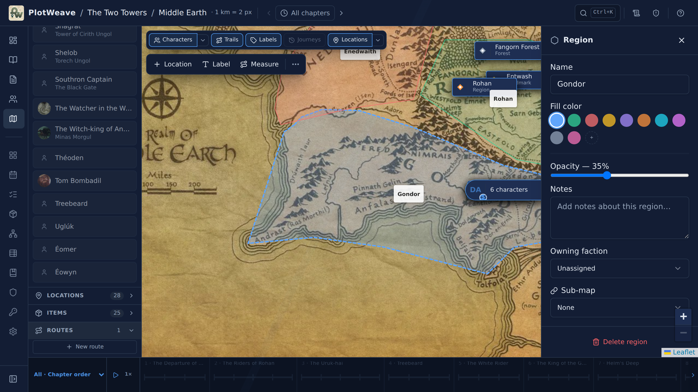

**Replace image** (in the **⋯** menu) swaps the picture behind the current map without losing any
of its content — handy for upgrading a sketch to a finished map or dropping in a
higher-resolution version. Upload (or link) the new image, and keep *Reposition
existing locations…* checked so every marker, route and region is scaled to the
new image's size and stays in the same relative spot (uncheck it for a same-size
redraw). The map's scale calibration is adjusted to match.

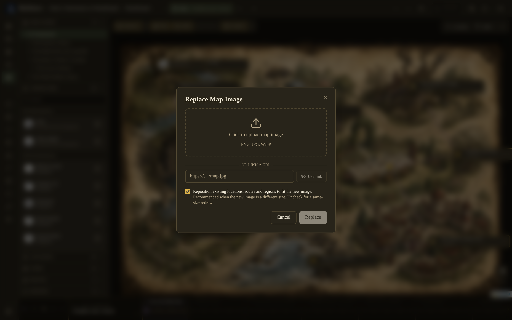

**Levels (floors).** Some places are one footprint stacked into several floors —
a castle with dungeons, a ground floor, upper floors and towers. Choose **Add
level** from the **⋯** menu to give the current map a floor above it: upload that floor's image and
name it (e.g. *First floor*). The map becomes a level group, and a **floor
switcher** appears on the right edge — floors stacked bottom-to-top, the current
one highlighted. Tap a floor to jump to it; your pan and zoom are held so a
stairwell or tower lines up between floors. Each floor is a full map with **its
own locations**, routes and regions, so a marker on the First floor stays on the
First floor. Add more floors with the **+** on the switcher, **rename** a floor
(double-click it, or the pencil), or remove one with its trash icon — deleting
the ground floor re-points the place's pin to the next floor so it stays
reachable. Levels differ from sub-maps: sub-maps are places you *drill into*
(Grounds → Castle), while floors are levels of the same place you *flip between* —
and the two compose, so a castle reached from the grounds can itself have floors.

Characters move between floors just by being at a location on a different floor
in the next chapter — no special "stairs" needed. On the parent map a character
on **any** floor shows at the building's pin, and during **playback** the map
follows them: as the story reaches a chapter where a character has crossed to
another floor, it switches to that floor and lands their pin at the right spot.

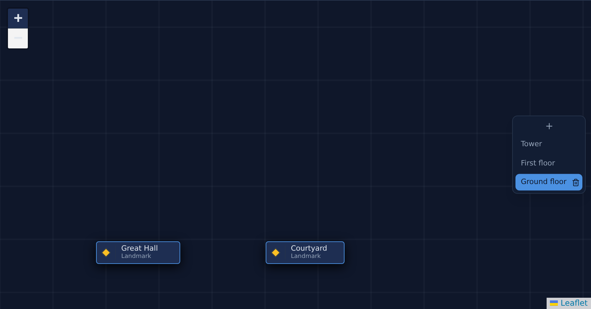

Press **play** in the chapter bar and the map becomes a playback stage: as the
story advances event by event, character pins glide between locations along their
routes, so you can watch your cast move through the world. The story-notes overlay
shows the current chapter, synopsis, and relevant character status notes. For a
frame narrative, the map can display outer-timeline characters as **ghost pins**;
a historical-echo relationship marks shared places with echo rings.

### Generate locations with AI

Don't have a map image? **Generate with AI** (on the empty Maps screen, and as
**AI Locations** in the map toolbar’s **⋯** menu) builds a whole **tree of places** for you.
Copy the prompt, describe your world, and paste back a nested JSON tree
(continent → kingdom → city → district). PlotWeave creates a blank **Locations**
map and drops each place on it as a pin; a place with children becomes a pin that
**drills into a sub-map** holding them, as deep as your tree goes — no map image
required. A multi-storey place (a castle, tower or keep) can use **`levels`**
instead of `children`: the AI lists its floors, each with its own locations, and
PlotWeave builds them as a [level group](#maps) with a floor switcher — so *Great
Hall* on the ground floor and *Library* on the first floor land on the right
floors automatically.

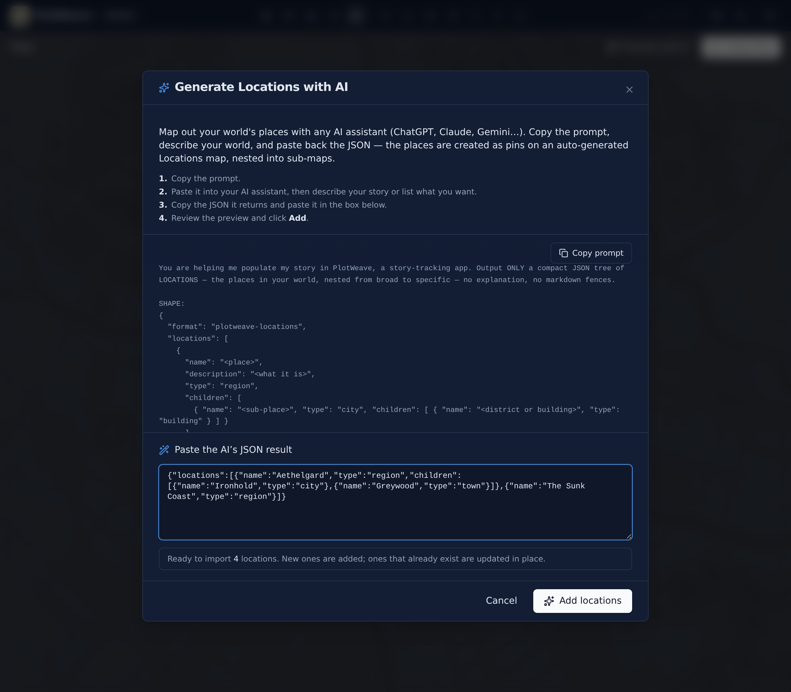

Re-running extends the same Locations map: new places are added, and existing
ones are **matched by name across the whole world** — updated in place and never
duplicated, even if the AI puts a place under a different parent than before. A
place's position in the tree is fixed the first time it's created; new children
still attach under it. So you can build the world out in passes. To help with that, the
prompt **lists the places you already have** (as an indented tree, floors shown
as `[bracketed]` headers) and tells the AI to extend them rather than repeat them
— reuse a place's exact name to nest new children under it, or add floors to a
leveled place by reusing its floor names. You can always upload a real map image later and move the pins
onto it.

---

## Items

Track the objects that matter — weapons, artefacts, documents, consumables — with
thumbnails, categories, and descriptions. Like characters, items have per-event
**placements** (who holds an item, or where it is, at any point in the story).

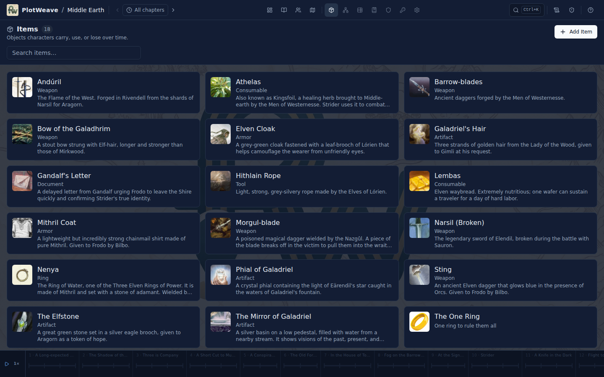

Like the cast, you can **Generate with AI** from the Items screen: copy the
prompt, describe your story, and paste back the JSON to add a batch of items to
the current world. It follows the same flow as
[generating characters](#generate-characters-with-ai) — new items are created and
items with a matching name are updated in place, so re-running never duplicates.

An item's detail page also lists every lore page linked to it. In a world with
multiple timelines, **Cross-Timeline Appearances** records where an artefact
originates, the timeline in which it is later found or encountered, and optional
encounter notes.

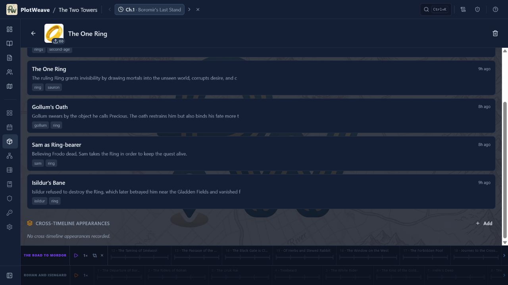

---

## Relationships

The Relationships graph visualises how your cast connects. Each edge is a
labelled, colour-coded relationship (allies, rivals, family, lovers…), and the
graph is fully pannable/zoomable with a minimap.

Create a relationship with the form or drag from one character node to another.
Relationships may be bidirectional or directed, can begin at a chosen event, and
carry a label, strength, sentiment, and description. Selecting an edge opens its
editor and an **Evolution** history of every event-based change. The faction
overlay colours character nodes by their active memberships.

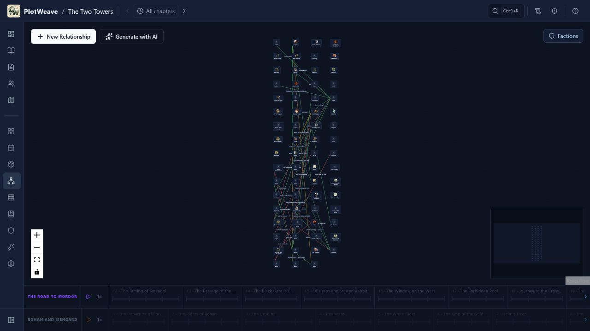

**Generate with AI** (top-left of the graph) adds relationships in bulk: copy
the prompt, describe your story, and paste the JSON back. Each relationship's two
endpoints reference characters by name — only pairs where **both** already exist
are imported (unknown names are ignored). A new pair is created; a pair that
already has a relationship is updated in place, so you can re-run safely.

Because relationships are **snapshot-aware**, the prompt also captures how a bond
*evolves*: each relationship can carry a list of **changes**, and each change
names an **existing event** where the state shifts (*allies → rivals →
reconciled*). Those become per-event snapshots, so as you move the time cursor
the graph shows the relationship as it stood then. Add your timeline events
first, since a change whose event doesn't exist yet is skipped.

Relationships are snapshot-aware too — they can change over the course of the
story (from *rivals* to *reconciled*), and the change is tied to the event where
it happens.

---

## Character Arc grid

The Arc view is a spreadsheet of your whole cast across story time. Choose
**Characters**, **Factions**, or **Threads** for the rows, and **Chapters** or
**Events** for the columns. Character cells show status, location, notes,
inherited state, and an inventory sparkline; faction cells show who belongs at
that moment; thread cells name the scene (or count the beats) that carries each
[plot thread](#plot-threads), so a subplot's rhythm — and its silences — read
straight down the row.

In a multi-timeline world, use **All** or a timeline pill to focus the columns.
The search box filters character rows, while the **Factions**, **Status**, and
**POV** overlays add membership, scene-status, and point-of-view colour cues.
Click a column to move the time cursor, expand a notes cell for its full text, or
export the complete grid as **PNG**.

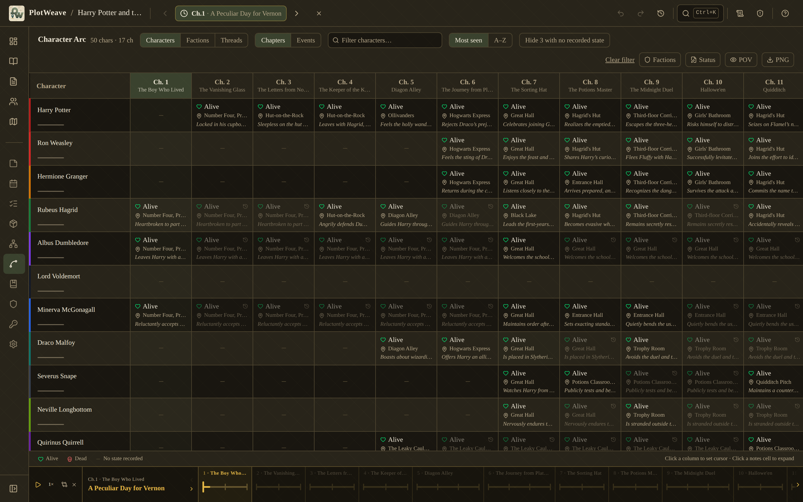

It's the fastest way to audit continuity across the entire book at once.

---

## Lore

Lore is your world's reference wiki — history, rules, and mythology that don't
change with time. Organise pages into **categories** (Artefacts, Peoples,
Places…), tag them, and optionally reveal a page only from a given event onward.

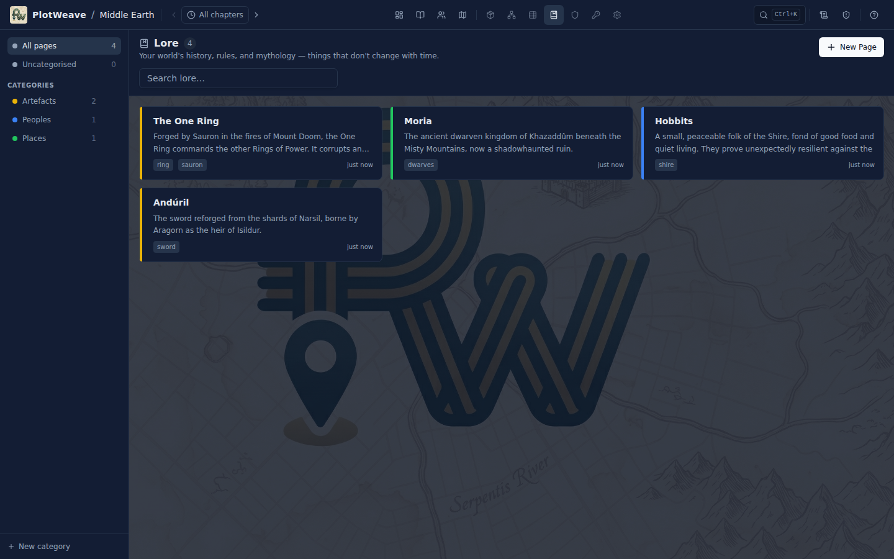

**Generate with AI** builds out your wiki in bulk: copy the prompt, describe your
world, and paste the JSON back. Pages are filed into **categories** by name
(created automatically); a page with a matching title is updated in place rather
than duplicated — same flow as
[generating characters](#generate-characters-with-ai).

Each page has a Markdown editor with an **Edit / Preview** toggle. **Link
entities** associates the page with characters, items, or locations; the page
then appears in those entities' Lore sections and in Writer's Brief when it is
relevant. Use **Revealed at** to choose the first event at which the page becomes
visible, and turn on the revealed-only filter in the Lore index to hide future
knowledge at the current cursor.

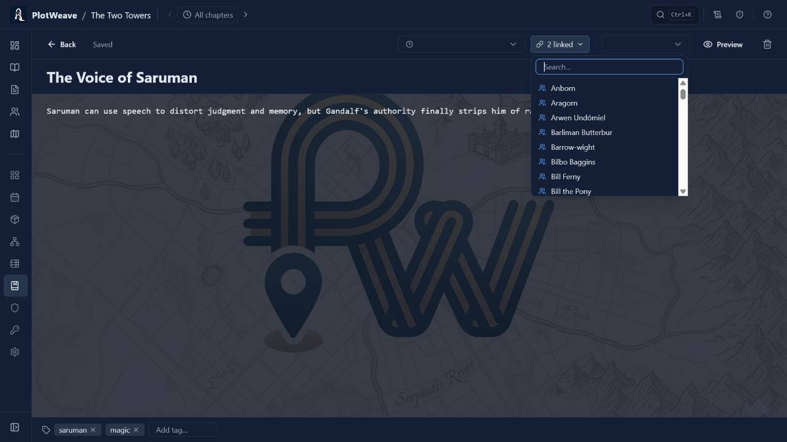

---

## Factions

Factions are the organisations your characters belong to — kingdoms, guilds,
cults, fellowships. Each faction has a colour, description, and **members** (with
roles and optional start/end events), plus **faction-to-faction stances**
(allied, hostile, and so on).

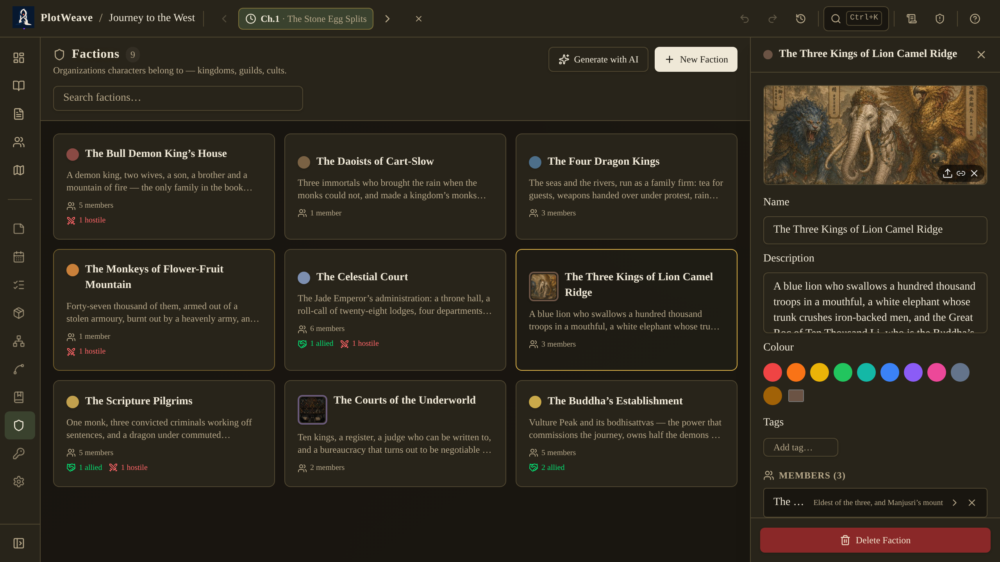

**Generate with AI** works here too: copy the prompt, describe your story, and
paste the JSON back. New factions are created and factions with a matching name
are updated in place (their members are merged in, never dropped). Faction
**members** reference characters by name — only names that already exist in the
world are linked (unknown names are ignored, and no characters are created), so
generate your cast first.

Regions and location markers can name an **owning faction**. Those assignments
appear under **Territories** on the faction detail panel. Turn on the Factions
overlay in the Relationships graph or Character Arc to colour characters by
their active membership at the selected event.

---

## Knowledge

The Knowledge tracker manages **who knows what, and when they learn it** — the
backbone of mysteries and dramatic irony. Record a **fact** (a secret or key
piece of information), mark when the **reader** learns it, and log **reveals** to
individual characters at specific events. PlotWeave even **suggests facts from
your story** (for example, "Gandalf the Grey is dead · Ch. 17").

After one character learns a fact, **Might also know** looks for other characters
who shared a later scene with a knower. Accept a suggestion to add the likely
reveal, or leave it untracked when the information was not actually shared.

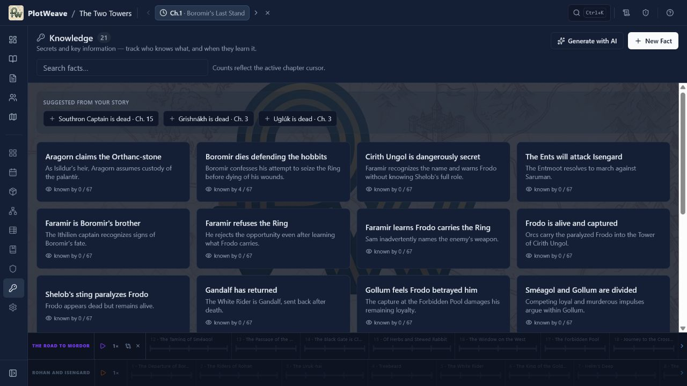

**Generate with AI** adds facts in bulk: copy the prompt, describe your story,
and paste the JSON back. A fact's `origin`, `readerLearnsAt`, and each reveal
reference **existing events by title** and **existing characters by name** — so
add your timeline and cast first. Anything that doesn't match is simply left
unlinked (the fact is still created). A fact with a matching title is updated in
place (its reveals merged in), so re-running never duplicates.

Paired with the Continuity Checker, this catches a character acting on
information they shouldn't have yet.

---

## Search

Press **Ctrl/⌘+K** anywhere to open the command-style search palette. It searches
characters, factions, items, locations, chapters, events, timelines,
relationships, routes, regions, and lore pages, grouped by type. Use the arrow
keys and **Enter** to navigate; opening an event also sets the time cursor, and
opening a location focuses its map marker.

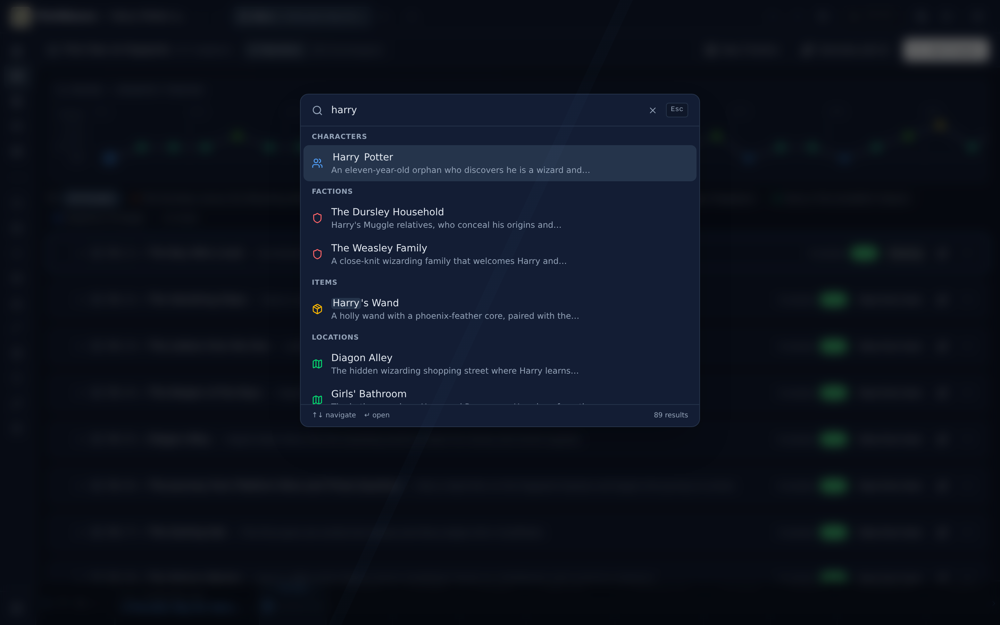

---

## Writer's Brief

The **Writer's Brief** (the scroll icon in the top bar) is a focused, at-a-glance
panel for the event under the time cursor. Select an event and the brief shows
the chapter synopsis, the active event's details (including the in-world date —
or day number if you haven't set up a calendar), the other events in that
chapter, and a per-character state readout — including **"carried forward"**
badges where a character's state was inherited rather than freshly set. When a
world calendar and a character's birth date are both set, each present character
also shows their **age** at that point in the story.

The brief also collects active relationships, item placements, and relevant lore.
Lore linked to a present character appears automatically; a page revealed at the
active event is marked **NEW** and links directly to its editor.

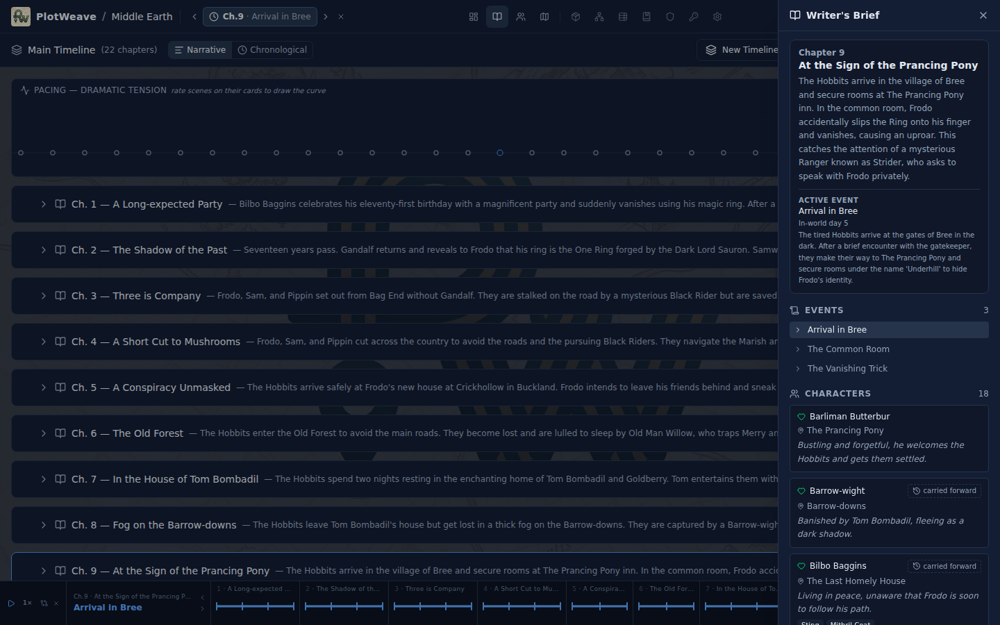

It's designed to sit open beside your manuscript while you draft.

---

## Calendar & character ages

By default PlotWeave measures story time in **in-world days** — day 0 is the
start of a timeline, and each event's *travel days* push the clock forward. Turn
those day numbers into real dates by giving your world a **calendar** in World
settings.

Click **Enable calendar** to start from a standard 12-month, 365-day year, then
tailor it:

- **Start year** — the year that in-world day 0 falls in.
- **Year suffix** — an era label shown after the year, e.g. *AC* or *TA*.
- **Months** — rename them, set each month's length in days, and add or remove
  months. A fantasy calendar can have any number of months of any length.

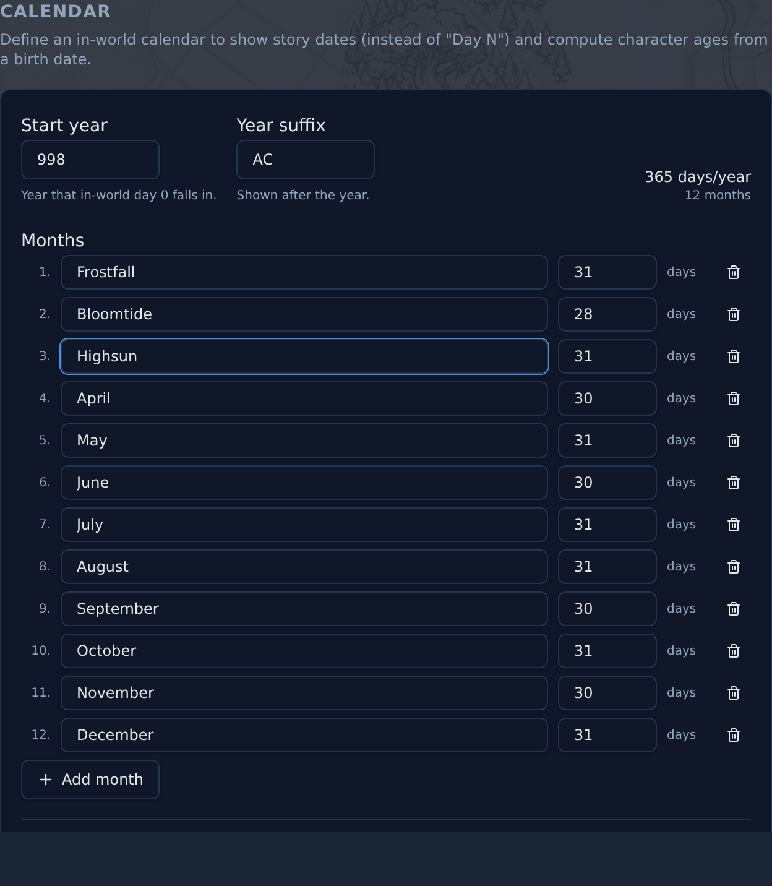

With a calendar set, in-world dates appear wherever the day clock is shown —
most visibly the active event's date in the Writer's Brief.

**Character ages.** Give a character an optional **birth date** on the Overview
tab of their profile (the month/day/year pickers use your calendar's months).
PlotWeave then computes and shows the character's **age** at the event under the
time cursor in the Writer's Brief — counting birthdays passed, so it stays
correct even with irregular month lengths. A character born after the current
moment simply shows no age.

The calendar and every birth date travel with the world through **export /
import**, so shared or backed-up worlds keep their dates intact.

### Calendar view

Once a calendar is set, the **Calendar** view (in the nav) lays your events onto
month grids by their in-world date, so you can see the shape of your story in
time. Each month that your story touches gets a grid; events appear as chips on
their day, and flashbacks are marked with a small clock icon.

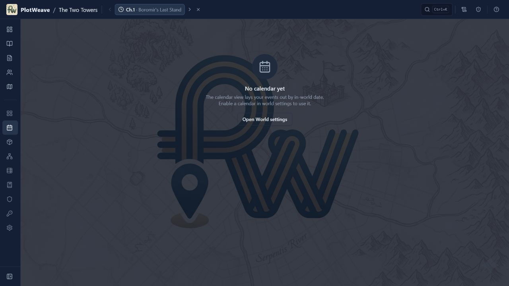

- **Click** an event chip to jump to it in the timeline.
- **Drag** a chip to another day to **pin** its in-world date — this sets the
  event's explicit in-world time, overriding the travel-day clock for that event
  (handy for flashbacks/flash-forwards, or to nail a scene to a specific date).

---

## Continuity Checker

The **Continuity Checker** (the shield icon) scans your whole world for
contradictions and surfaces them grouped by category, with an error/warning
count. Typical catches:

- A character who is **alive after dying** in an earlier chapter.
- A **dead character** appearing in a later scene (with a one-click "mark as
  flashback" if intentional).
- A character who **appears before their first snapshot**, or is at a
  **destroyed location**.
- A character who **can't reach a location in time** — when a move covers more
  map distance than their travel mode can cross in the in-world days available
  (using the map scale, the mode's speed, and any road/river/trail along the
  way). The finding offers a one-click **"Allow N more days"** that lengthens the
  event so the journey becomes possible.
- A character who **travels through a destroyed or abandoned region**.
- An item that is used before it was acquired, an impossible item handoff, a
  relationship or faction membership that starts at an invalid moment, or a POV
  character who should not be available at that event.

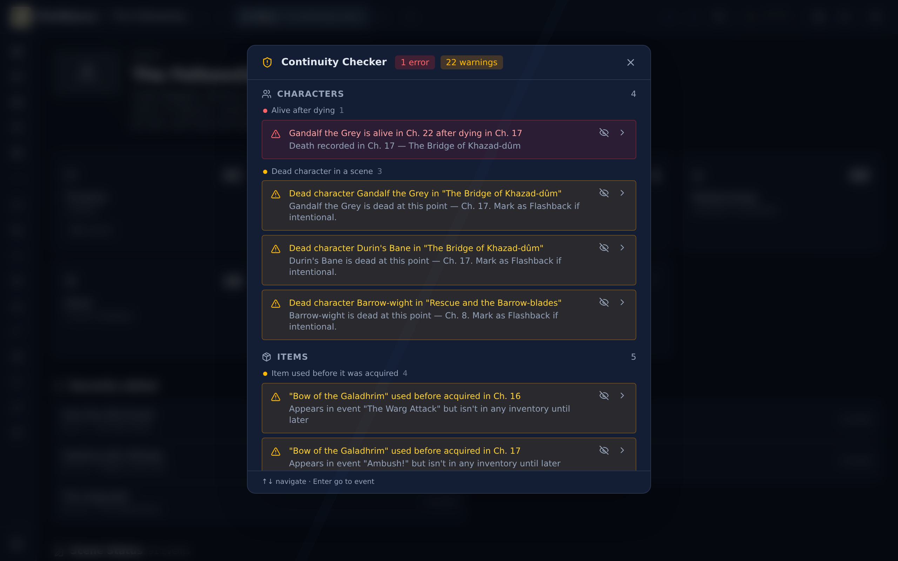

Each finding links straight to the offending event so you can fix it in context.
The travel checks rely on a **map scale** (set one on the map) and **travel
modes** with speeds (in World settings). The stale-snapshot sensitivity is
configurable in Settings. If a finding is intentional, **suppress** it and add an
optional reason. The checker can show suppressed findings later so you can review
or restore them.

---

## World settings & export

Per-world settings let you rename the world, set a **cover image**, pick a
**theme** (Default, Fantasy, Sci-Fi, Cyberpunk, Horror, Western, Action, Noir,
Romance), define **travel modes** with speeds for map distance calculations, set
the **continuity stale-snapshot threshold**, set a book-level **word target** and
**deadline** (for the dashboard's [Writing Progress](#the-world-dashboard)
burndown and finish projection), and configure an in-world
**[calendar](#calendar--character-ages)** for story dates and character ages.

Worlds with more than one timeline also get a **Timelines** section: give each
timeline a **start day** for its clock. By default every timeline starts at
day 0 — right for parallel storylines, but a frame narrative's past or an
earlier era belongs at a different point on the world clock. Setting, say,
day 10,000 on the "present" timeline makes chronological merges (the
All-timelines view and the bottom bar) and the calendar place both eras where
they actually fall. An event's pinned in-world day stays relative to its own
timeline's clock.

The **cover image** appears on the world's card in the selector and in the
dashboard header. **Upload** an image file or **link** one by URL (the link
icon), and **Remove** it at any time — the same as portraits elsewhere in the
app.

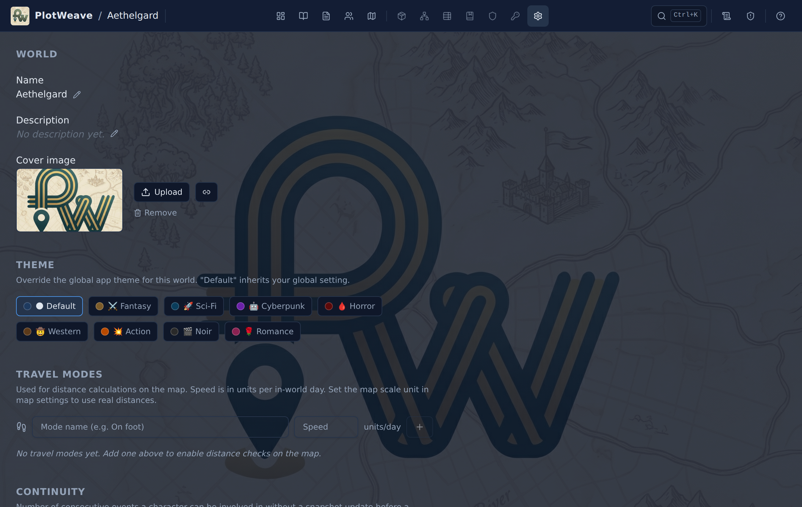

**Export** options:

- **Export as HTML** — a read-only, shareable snapshot of the world that anyone
  can open in a browser.
- From the world card menu, export the full world as a **`.pwk`** file (data),
  optionally split with a **`.pwb`** images file. These are the files you import
  back on the world selector — the app's portable, offline save format.

### Database health

Deleting a parent record can occasionally leave an old snapshot, membership, or
sub-map reference behind—especially after importing older files. **Scan for
orphans** reports those unreachable records by table, and **Clean up** removes
only the records whose parent no longer exists.

### Folder and cloud sync

On Chrome, Edge, and the desktop app, choose a **sync folder** to bind the world
to a `.pwk` file in any local folder—including one managed by Google Drive,
OneDrive, Dropbox, or another file-sync service. **Save** writes the current
world; **Load** previews the file before applying it.

- **Smart merge** compares records and keeps the newer version of each entity,
  which is useful when the same world was edited on two devices.
- **Replace all** overwrites the local world with the selected file.
- **Change folder** moves the binding. **Disconnect** removes the binding without
  deleting the file already stored in that folder.

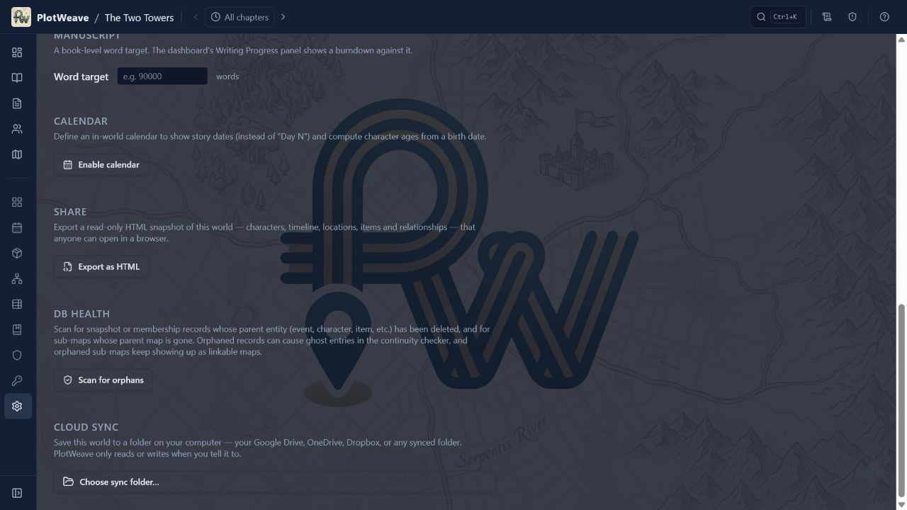

---

## Help

The **Help** panel (the ? icon, top-right) is available on every screen with
in-app explanations of each concept — the time cursor, snapshots, timelines,
maps, playback, and the rest.

The Help panel also lists keyboard shortcuts: **Ctrl/⌘+K** opens search,
**Shift+click** selects an event range, arrow keys and **Enter** navigate search
or continuity results, and **Esc** closes panels or cancels inline edits.

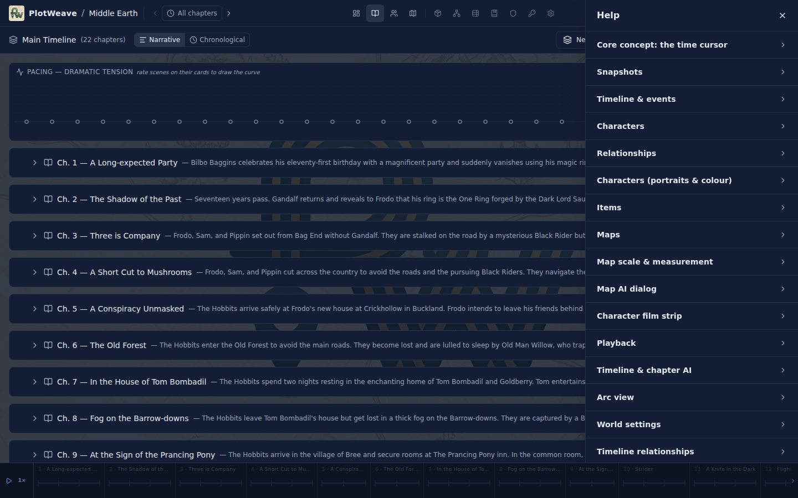

---

*PlotWeave keeps all your data on your own device. Export regularly to back up or
move between machines.*
