# Reading with PlotWeave open beside me — 2026-08-26 (blind run)

A reader's pass, not an author's. No prior review, roadmap or history was read.
Every judgement below comes from using the app; source was consulted only *after*
observing something, to name the mechanism.

## What I set out to read, and how far I got

Downloaded **Dracula** from the Library, left reading mode on, and read as far as
chapter 7 (the Demeter cutting), moved on to chapter 9, put it down, came back
cold on a phone, then started **Jane Eyre** as a second book and read to chapter 7
there. Desktop 1280×900 and 1280×844; phone 390×844, with checks at 360 and 320.

Every finding below was reproduced at least twice. Three suspicions I formed were
**measured false** and are listed separately, because two of them looked like the
most serious things in the run.

---

## What interrupted me — ranked by what it cost me

### R1 — The list of chapters I have *not* read tells me how the book ends
**Cursor: Jane Eyre, Ch.1 · "Jane Reads Behind the Curtain". Reading mode on. SPOILER.**

I clicked "Set where you have read to" on the dashboard. It takes you to the
Timeline. Every one of the 38 chapters is listed, each unread one carrying a
padlock icon — and each carrying its title:

- Ch. 9 — Helen's Last Night
- Ch. 26 — The Interrupted Wedding
- Ch. 33 — A Name and an Inheritance
- Ch. 36 — The Ruins of Thornfield
- Ch. 38 — Reader, I Married Him

At chapter 1, Jane has not met Helen Burns, Thornfield, or Rochester. The app is
simultaneously withholding chapter 2's one-line synopsis and hiding 21
characters, 29 places and 9 items — while printing a padlock next to "Reader, I
Married Him".

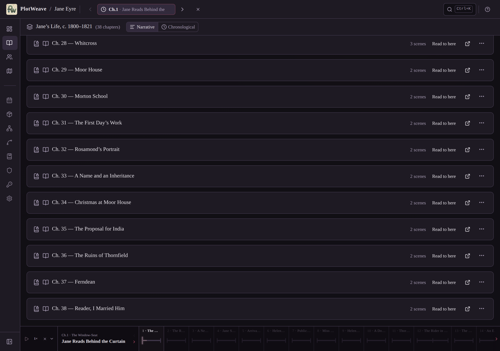

The same titles appear in the bottom chapter strip, in the Character Arc column
headers, and in the search palette.

**Why this is not a content complaint.** The gate has an explicit written rule
for it, in `src/features/search/SearchPalette.tsx`:

> `// A chapter's title is printed on the reader's own contents page, so it`
> `// stays searchable. Its synopsis is an authored summary of what happens`
> `// in it, so it neither matches nor shows until the reader gets there.`

I tested that premise rather than assuming it. For **Dracula** it holds:
"Ch. 24 — Dr Seward's Phonograph Diary, spoken by Van Helsing" *is* Stoker's own
chapter heading, so I withdrew that half of the finding (see *Measured false*).
For **Jane Eyre** it is false — Brontë's chapters are headed "CHAPTER I" and
nothing else. All 38 titles are editorial. 26 of the 30 library `.pwk` files have
titled chapters and the app cannot tell an editorial title from a printed one.

**Cost:** total. It is on the screen the app itself sends you to when you tell it
where you are, so you cannot avoid it. There is no "hide unread chapters" option
anywhere in Settings.

---

### R2 — Search hands me a map route from chapter 24 while I'm on chapter 1
**Cursor: Dracula, Ch.1 · "Eastward by Rail" — the first scene of the book. SPOILER.**

Typed `Hunters` into the search palette. One result:

```
ROUTES
The Hunters to Varna
rail
```

At chapter 1, Jonathan is on a train to Bistritz. There are no hunters, and Varna
has not been named. This is the pursuit of chapters 24–26.

This one has no "it's on the contents page" defence, and the app's *own map
screen* proves the intended behaviour: at Ch.7 the Maps sidebar reads `ROUTES 0`
and the string "Hunters to Varna" is nowhere in the DOM. Two different gates:

- `src/db/hooks/useMapRoutes.ts:20` — `all.filter((r) => gate.linksRevealed(r.waypoints…))`
- `src/features/search/SearchPalette.tsx:244` — `(routes ?? []).filter((r) => layerRevealed.has(r.mapLayerId))`

The Europe layer is reached in chapter 1, so all three of its routes are
searchable from the first page. Regions (line 249) use the same weaker filter.

**Cost:** high, and it fires on innocent queries. I typed "Varna" because I'd just
read the word in the Demeter's log.

---

### R3 — A 16-pixel ✕ in the bottom bar reveals the whole book and deletes my place, with no confirmation

Reproduced at 1280px and 390px, from a clean chapter-7 position:

| | before | after one click |
|---|---|---|
| Characters | 14 | **25** (Van Helsing now listed) |
| Lore pages | 11 | 14 |
| Map markers | 21 | 60 |
| Items | 10 | 17 |
| Dialogs shown | — | **0** |
| World-list card | "Chapter 7 of 27" | *line gone* |

The control is `title="Clear selection"`, **16.4 × 16.4 CSS px**, sitting in the
always-present bottom playback bar between the `1×` speed toggle and a collapse
chevron: `▷ 1× ✕ ⌄`. On a 390px phone it sits at x=54, y=804 — 40px from the
bottom of the screen, in the thumb zone. Next to a collapse chevron, an ✕ reads
as "close this bar".

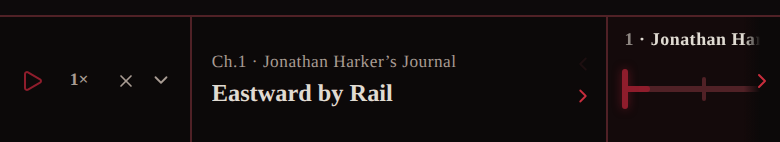

`src/components/ChapterTimelineBar.tsx:267` → `onClear={() => setActiveEventId(null)}`,
ungated, unconfirmed. Its sibling in the same control row, "Compare chapters",
*is* gated (`showDiff && !gate.active`, `TimelineControls.tsx:75`).

The twin control in the top bar — the 32×32 ✕ next to the position pill — does
exactly the same thing and **is** properly guarded (see *What worked*). So the
design intent is unambiguous; one of the two paths was missed.

Recovery: none. There is no undo and no separately-tracked "furthest read", so
the world card simply loses your bookmark.

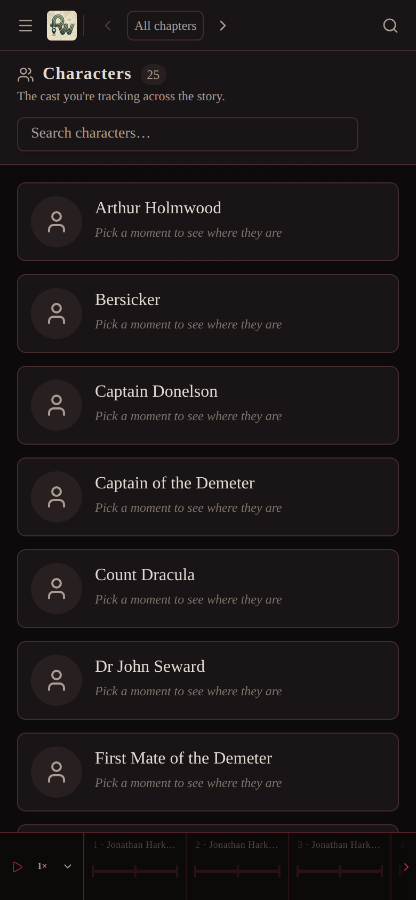

*This is also how I lost my own place mid-run without noticing — I only found the
cause when I went back to prove a different claim.*

---

### R4 — Lore is fail-open, and the control that looks like the safety catch does nothing
**Cursor: Dracula, Ch.7 · "A Sailor Disappears". Reading mode on. SPOILER.**

The Lore screen shows 11 of the world's 14 pages. Among them, in full, at chapter 7:

- **The Un-Dead State** — "A vampire victim may rise after death, feed on others, and retain a corrupted version of personality. The hunters understand destruction as release rather than punishment."
- **Vampire Powers and Limits** — "Dracula can alter apparent age, command animals, become mist or animal, scale walls, and exert hypnotic influence…"
- **Consecrated Protection** — "Crucifixes, garlic, and consecrated wafers repel, bar, or sterilize vampire spaces."
- **Carfax and Purfleet** — "Dracula's purchased estate lies beside Seward's asylum. Its ruined chapel initially stores the fifty earth boxes."

At chapter 7 the reader knows Dracula climbs walls and has no reflection. They do
not know victims rise, that garlic and wafers work, or that there will be a group
of "hunters" — those are chapters 10, 12–16 and 22.

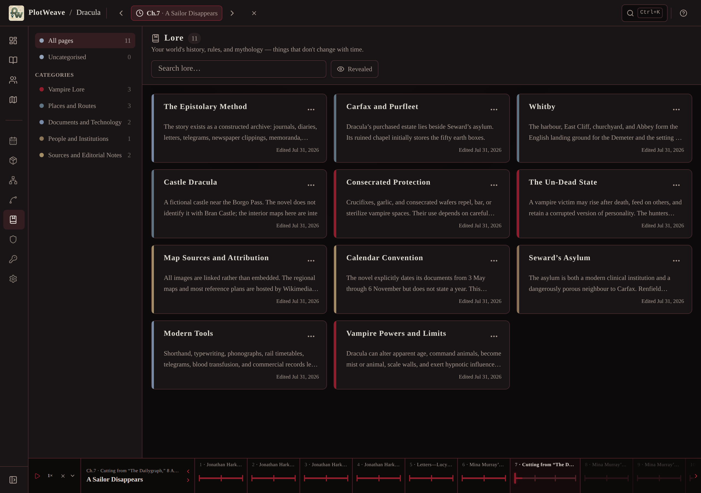

Mechanism, measured: every one of Dracula's 14 lore pages has
`visibleFromEventId: null`, and `useReading.ts:170` returns
`hasReached(null) === true`. So the only thing gating lore is
`linksRevealed(linkedEntityIds)` — a page is visible if the characters it happens
to link to have been met. That is a proxy, and it fails open by default in the
one place a reader goes to ask "what are the rules of this world".

**Compounding it:** the screen carries a button labelled **"Revealed"** with an
eye icon, `title="Show all lore"`. I clicked it. Nothing changed — label
unchanged, count still 11, both directions. `LoreView.tsx:226` filters on
`p.visibleFromEventId`, which is null for all 14 pages, so the toggle is a no-op.
Its default-off state and "Show all lore" tooltip actively suggest to a reader
that what they're looking at is *unfiltered* — which is very nearly true, and is
not reassuring.

---

### R5 — I added a scene to *Dracula*, in reading mode, and then could not delete it

On the Timeline, expand any chapter row → an **"Add Scene"** button appears at the
bottom of the scene list. Two clicks opens the full author dialog: Title,
Description, Characters involved, Setting, Point of View, Tags, Status.

I filled in a title and pressed Add Scene. Measured against IndexedDB:
**`events` 216 → 217.** Chapter 1 now reads "4 scenes", the new row appears in the
chapter list, and it appears in the pacing table as
`1 | READER TEST SCENE | Unrated | 0`. Reproduced at 390px and 1280px.

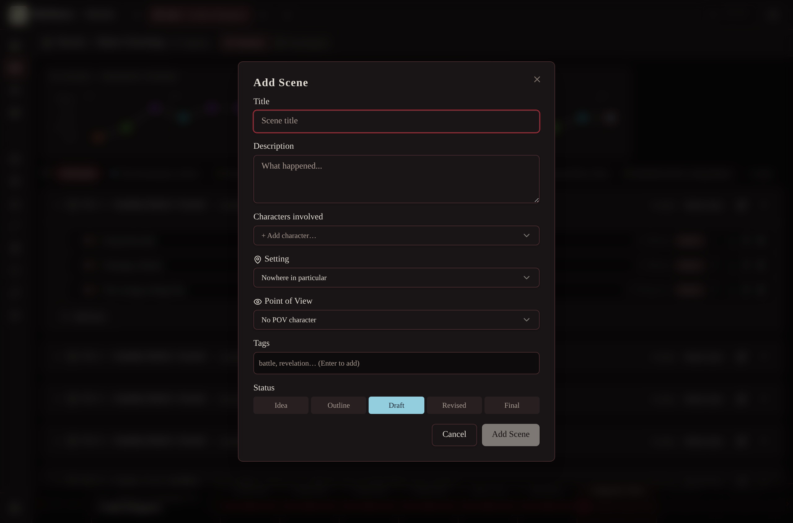

Asymmetric in the worst direction: `ChapterDetailView.tsx:410` guards the
identical button with `!gate.active`; `ChapterRow.tsx:405` does not. And
`EventRow.tsx:77` **does** gate the per-scene controls — so a reader can create a
scene and cannot remove it without turning reading mode off, which is the one
thing the mode exists to make unnecessary.

---

### R6 — "Download (363 KB)" does not download the pictures

Opened Maps at chapter 7 to ask the obvious reader question — where is Whitby
relative to the Borgo Pass. Got a black rectangle with four floating "4
characters" pins at meaningless pixel coordinates, under this banner:

> "This map's picture could not be loaded — it is kept on the web rather than in
> the book, so it needs a connection. Everything marked on the map is still here."

The message is honest and well written. The consequence isn't: **all 76 blobs in
`dracula.pwk` are remote `https://upload.wikimedia.org/...` URLs**, so all 10 of
Dracula's maps are unavailable to anyone reading in bed on bad wifi, on a train,
or on a plane — which is most reading. Nothing in the Library warns about this;
the card just says "Download (363 KB)".

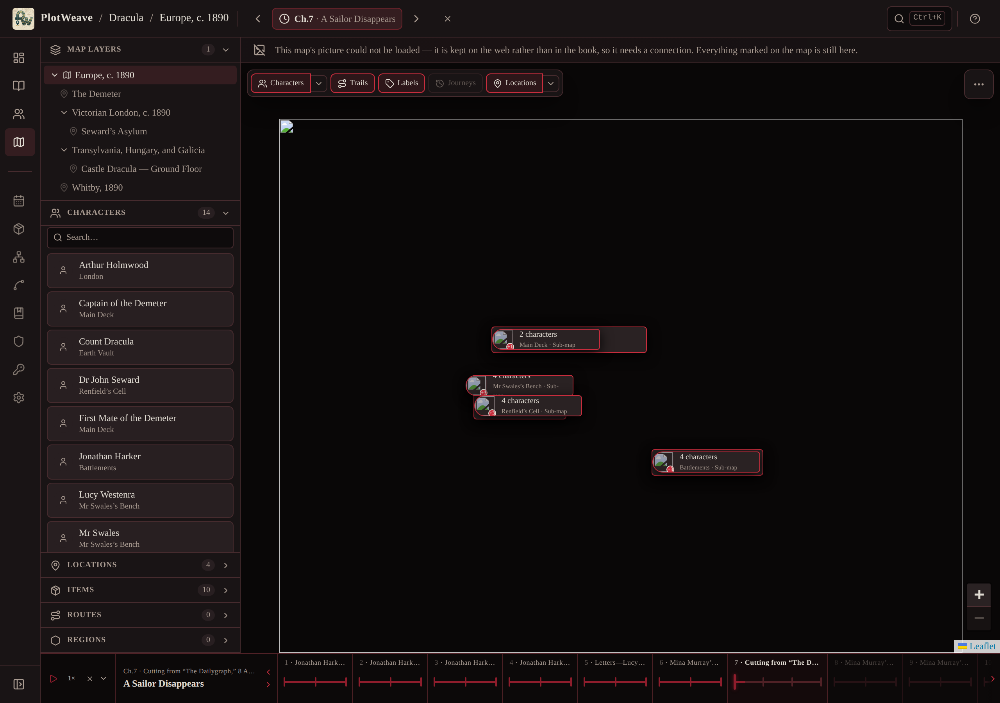

The concept exists — 4 of 30 entries (the Tolkien and Rothfuss worlds)
additionally offer "With images (14.6 MB)". The other 26 don't. Separately, 26 of
30 library **cover thumbnails** are remote too, so the shelf is text-only offline.

*Caveat, stated plainly:* my sandbox proxies outbound HTTPS, so I observed the
offline case, not a broken URL. The finding is about the offline case, which the
app itself has written a message for.

---

### R7 — On a phone, the chapter summaries disappear

At 390px, Timeline, reading mode, Ch.7. The one-line chapter recap — *"Jonathan
travels through Bistritz and the Borgo Pass to Castle Dracula"* — that is the
single most useful thing on the desktop version of this screen is **not rendered
at all** on the phone. Checked both collapsed and expanded: `body.innerText` does
not contain "Bistritz and the Borgo Pass" at 390px, and does at 1280px.

So the answer to "what happened in chapter 3 again?" is available on the device
you're not reading on.

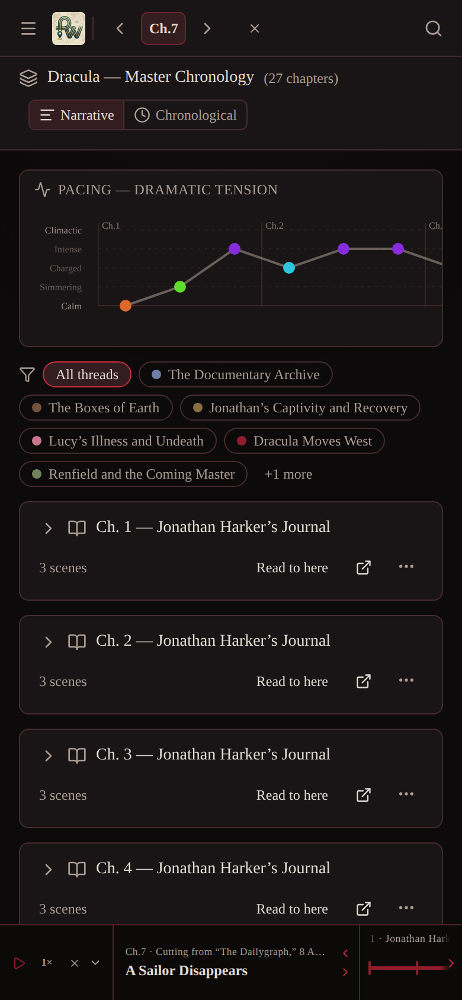

Above it, on that same 844px-tall screen: the "PACING — DRAMATIC TENSION" chart
and the plot-thread chips. The first chapter row starts at **y=436 of 844** — 52%
of the phone screen, before any chapter, is author analytics. The playback bar
takes another 64px at the bottom permanently.

---

### R8 — The first screen after downloading summarises the whole novel
**Cursor: Ch.1. Reading mode on. SPOILER.**

The Library drops you on the Dashboard. Directly under the title, above the
"Reading mode is on" banner:

> "Count Dracula leaves his Transylvanian castle and carries his predation into
> England. **As Lucy Westenra falls under his influence and Mina Harker becomes
> his next target**, a group of friends unites its knowledge, faith, and courage
> to hunt him back across Europe."

Jane Eyre's is the same shape: Lowood, governess at Thornfield, flight across the
moors, discovery of family.

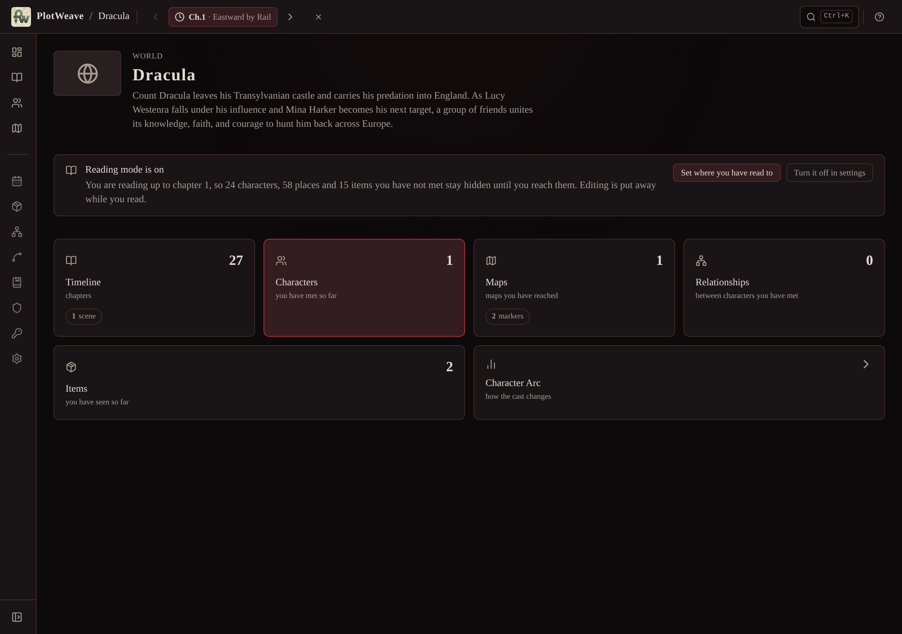

The dashboard deliberately renders `world.description` as prose in reading mode
(`WorldDashboardView.tsx:404` — the edit affordance is correctly removed, which is
right). The text itself is never gated, and the same string is repeated on the
world-list "READING" card.

Worth noting: Dracula's *Library* blurb is markedly safer — "Journals, letters,
logs, and telegrams converge as Dracula moves from Transylvania to England and
the hunters follow him home" — so a spoiler-lighter string exists and is discarded
at import. (Jane Eyre's library blurb is not much safer, so I'm not claiming a
general fix is sitting there.)

Counter-argument I'll give honestly: a back-cover blurb is something readers
accept. But "Mina Harker becomes his next target" gives away both the marriage and
the third act, and it is the first sentence on the first screen.

---

### R9 — Plot-thread chips name beats that haven't happened
**Cursor: Ch.7. Reading mode on.**

The Timeline's thread filter is gated — 7 of 9 threads shown at Ch.7, 2 held back.
But the names come through whole:

> **Lucy's Illness and Undeath** · Jonathan's Captivity and Recovery · Renfield and
> the Coming Master · The Boxes of Earth · Dracula Moves West · Learning the
> Vampire's Rules

At chapter 7 Lucy has sleepwalked once. "Undeath" is chapter 16. The chip appears
the moment the thread's first scene is read, so the gate is doing its job at
entity granularity and the *name* is carrying the arc through it — the same shape
as R1 and R8.

---

### R10 — Character pages: four empty tabs and copy addressed to someone else

Mr Swales, one click from the Characters list, ~2.2s. The description — "An
elderly Whitby resident whose skepticism gives way to dread" — is exactly right
and answered my question faster than the paperback would have.

Around it, in reading mode:

- 8 tabs, of which **Goals 0 / Relationships 0 / Lore 0 / Factions 0** — four
  one-click dead ends.
- **Goals:** "Track what this character wants, needs, fears, and what flaw holds
  them back — the inner life behind their scenes."
- **Lore:** "Open a lore page and use the link button to associate it with this
  entity." (plus an "Open Lore" button)
- **Appearances:** "Not mentioned in any scene yet. Type **@** in a scene's draft
  to refer to Mr Swales without putting them in the room."

There are no scene drafts in reading mode — the Manuscript screen is hidden. The
third one instructs the reader in a feature they cannot reach.

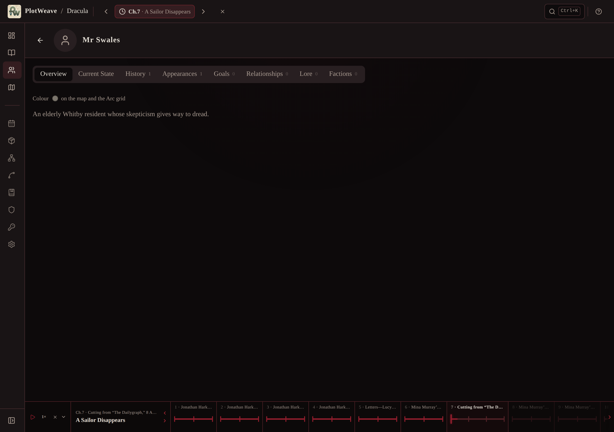

Above the description, the first line of the page is `Colour ● on the map and the
Arc grid`. It isn't clickable (I checked — it's a `<span>`), so it isn't an edit
invitation; it's just the author's field, first.

Also: the search placeholder reads **"Search your world and the prose you wrote…"**.

---

### R11 — Coming back the next evening, on a phone, my books are a screen and a bit down

Closed the browser, reopened at the root URL on a 390px phone. The whole first
viewport is author chrome: *"A story bible for fiction writers"*, New World,
Generate World from AI, Library, Import World, Import Manuscript, then two demo
worlds that shipped with the app.

The **READING** shelf — Dracula, "Chapter 7 of 27", with a progress bar — starts at
**y=916** on an 844px viewport. 940 at 360px, 984 at 320px. You scroll past
everything you're not doing to reach the thing you are.

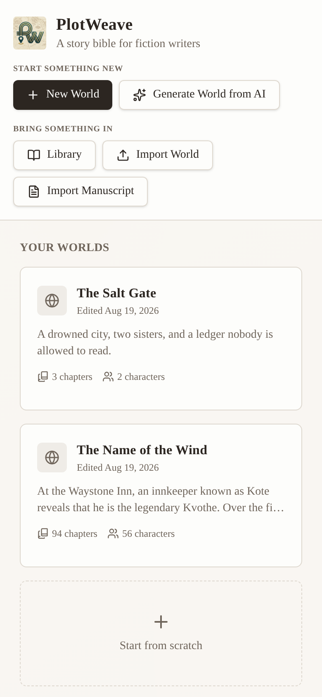

The shelf itself is genuinely good once you get there (see *What worked*).

---

### R12 — Help has 24 sections and none of them is about reading

Tapped `?` while in reading mode. Full list: Getting started · Dashboard & story
planning · Core concept: the time cursor · Snapshots · Timeline & scenes ·
Characters · Relationships · Items · Maps · Map scale & measurement · Map levels ·
Character film strip · Playback · Arc view · World settings · Timeline
relationships · Factions · Lore · Knowledge · Calendar & character ages · Search ·
**Database health** · **Folder sync & export** · Keyboard shortcuts.

A reader wondering what the ✕ next to their position does, or how to move their
place, has 24 wrong answers available.

---

### R13 — The relationship graph is unreadable at the zoom it opens at

14 nodes at Ch.7, name labels rendering at roughly 7px, and a banner that says so:
**"Zoom in to read the relationship labels."** "How is Arthur connected to Lucy?"
needs a zoom and a pan. There is a "Tidy up" button (an author's re-layout)
present in reading mode, and nodes are draggable.

I suspected the drag was writing into the author's world. **It isn't** —
`RelationshipGraphView.tsx:608` writes to `localStorage`, and "New Relationship" /
"Generate with AI" are correctly hidden behind `!gate.active`. So this is
fiddliness, not damage, and I've ranked it accordingly.

---

### R14 — Moving your place forward is one unguarded click, and the click itself spoils

Separate from R3. The bottom chapter strip shows unread chapters dimmed (opacity
0.42) but fully titled, scrollable to chapter 27. A single mouse click on the
dimmed "9 · Mina Murray's Journal" block moved my cursor from **Ch.7 · A Sailor
Disappears** to **Ch.9 · "Jonathan and Mina Marry"** — no dialog, `dialogs: 0` —
and the scene title it lands on is itself the reveal.

This is the intended way to advance, so it shouldn't be blocked. But jumping
*forward past where you've read* is irreversible (no furthest-read mark, no undo)
and gets no acknowledgement at all.

---

## What I only suspect — kept separate

- **Chapter-title exposure across the rest of the Library.** I proved it for Jane
  Eyre (38/38 titles editorial) and disproved it for Dracula. I did not check the
  other 28. A quick scan shows 26 of 30 have titled chapters, but some of those
  titles are the books' own (Treasure Island, Monte Cristo, Alice, Fellowship).
  *What would settle it:* for each library world, compare its chapter titles
  against the source edition's contents page and record, per world, whether titles
  are printed or editorial — so the gate has something to read rather than a
  blanket assumption.
- **Whether the Ch.7 → "Read to here" semantics confuse people.** "Read to here"
  on chapter 7 puts the cursor on the *first* scene of chapter 7, and the chapter
  row then shows chapter 7's whole synopsis, including its ending. Whether a
  reader means "I've finished 7" or "I'm starting 7" is ambiguous, and one of those
  readings leaks a chapter. I observed the behaviour; I have no evidence about
  which reading people hold. *What would settle it:* ask five people what "Read to
  here" means to them.
- **The `.pwb` image bundles.** I saw the button ("With images (14.6 MB)") but did
  not download one, so I can't say whether that path produces a working offline map.

## What I was wrong about — measured false

Worth recording, because two of these were the biggest things in my notebook
before I checked them.

1. **"The top-bar ✕ reveals the whole book without asking."** It does not.
   `TimeCursor.tsx:163` routes through `revealAllAction()` and shows a confirm
   dialog: *"Show the whole book? Viewing all chapters drops back to the full
   world — every character, place and subplot, including the ones the story has not
   introduced yet. Step the cursor instead to keep reading spoiler-free."* That is
   exactly right, and the surrounding source shows it was hard-won. My cursor
   really had been cleared — by the *other* ✕, which is R3.
2. **"Search leaks chapter titles from ahead of the cursor (Dracula)."** It does,
   but Stoker's own chapter headings are "MINA HARKER'S JOURNAL", "DR. SEWARD'S
   PHONOGRAPH DIARY, SPOKEN BY VAN HELSING". The code's stated premise holds for
   that world. Withdrawn for Dracula; it survives only where titles are editorial
   (R1).
3. **"Dragging a node in the relationship graph writes into the author's book."**
   It writes to localStorage. Downgraded to R13.

Also checked and found *correctly* gated: scene titles in search (`Marry`, `stake`,
`Piccadilly` at Ch.7 → "No results", even though "Jonathan and Mina Marry" exists
in chapter 9); chapter synopses in search and in the Timeline list;
character/item/location/relationship/faction entities; the Character Arc grid's
columns; map routes and regions *on the map*; the entire Manuscript surface; and
the edit affordances on the world description, Goals, and Relationships.

---

## What worked, and shouldn't be broken by any of the above

- **Getting a book in is excellent.** Library → search → Download → **7 seconds**
  and you are standing in the world with reading mode already on at chapter 1,
  with a banner that says in plain English what is hidden and how much of it. No
  configuration, no decision.
- **Saying where you are costs two clicks.** "Set where you have read to" →
  Timeline → "Read to here" on your chapter. The position pill is in the top bar
  on every screen, and `‹ ›` step it a scene at a time.
- **The Knowledge screen is the best thing in the app for a reader.** Two taps,
  **1.9 s**, and it answered "who else knows Dracula casts no reflection?" with
  `KNOWN BY (1) — Jonathan Harker · Ch.2 — No Reflection`. Gated exactly right (3
  facts at Ch.7). A paperback cannot do that at any price.

  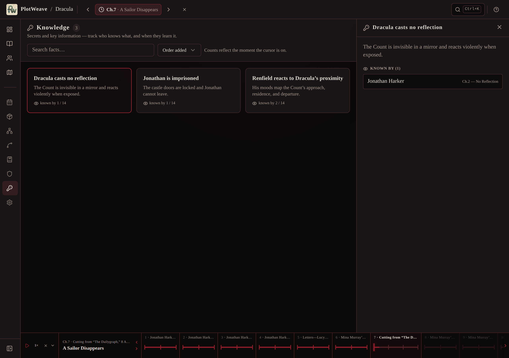

- **"Who is this again?" is genuinely fast.** Characters → tap the name → **2.2 s**
  to "An elderly Whitby resident whose skepticism gives way to dread." Faster than
  flicking back, and it's the whole reason to have the thing open.
- **The reading shelf remembers you.** Come back cold, and the world list has a
  **READING** section with each book, a progress bar, and "Chapter 7 of 27". Two
  books in progress side by side, each holding its own place.
- **"carried forward" is honest.** At Ch.7 Jonathan is shown at "Battlements" with
  a *carried forward* badge — his last known position from chapter 4 — rather than
  a guess. That is the correct answer to "where is he now?" and it is what the
  paperback would tell you.
- **Settings in reading mode is disciplined** — two sections only, and it warns you
  that re-downloading a library world discards your changes.
- **The Character Arc grid** is well gated and answers "who was where, and how did
  they feel" better than any other screen.

---

## Verdict

**It helps — and then it hands you the bookkeeping, and once in a while it hands
you the ending.**

There is a real reader's companion in here. The download-to-reading path is two
clicks and seven seconds; setting your place is two more; "who is this again" and
"who else knows about the will" are answered in about two seconds each, gated
correctly, and better than the book itself can answer them. The gate is not a
veneer: it reaches into map routes, relationship snapshots, faction membership,
arc columns and search entities, and it holds on screens nobody would have thought
to check.

But the promise is *tell me only what I have already read*, and the promise is
broken in four places I could reproduce from an ordinary reading position — a
locked chapter list that is a synopsis, a search index that returns a route from
chapter 24 on page one, a lore shelf that fails open by default, and a plot-thread
strip that names the arcs before they happen. None of these are gaps in the books'
content; each is the gate reading the wrong field, or defaulting to visible when it
has nothing to read. And one 16-pixel ✕ in the bottom bar can undo the whole thing
in a single unconfirmed tap, right where a thumb sits, while its properly-guarded
twin sits 750 pixels away at the top of the same screen.

The bookkeeping part is the pacing chart above the chapter list, the playback speed
control on every screen, the four zero-count tabs on every character, the
instruction to type `@` in a scene draft, the twenty-four-section author's manual
behind the `?`, and the "Add Scene" button that let me write a scene into *Dracula*
and then wouldn't let me take it out. On a phone that pressure is worse, not
better: the pacing chart is still there, and the chapter summaries — the thing a
reader actually came for — are not.

So: not *mostly* the author's bookkeeping. But close enough to it that a reader has
to look past a workbench to find the companion, and has to trust a promise that
four screens quietly don't keep.
