# Writer run — 2026-08-25 (blind)

A working session in PlotWeave as a novelist, not a tester. No prior review, roadmap,
issue list or commit history was read. Every judgement below comes from driving the
production build (`npm run build` + `vite preview`, Chromium via Playwright) at
1440×900. Source was consulted only *after* observing something, to name the
mechanism.

---

## What I set out to do

Write a second-world fantasy from nothing and do the bookkeeping the app asks for:

> **The Weight of Bells** — Anhalt-under-Ash is governed by seven bells. One of them
> is a lie. A bell-founder thins the tin for eleven years; her daughter finds out; an
> inspector of the Assize of Weights arrives; a letter goes into a coat lining and
> comes out in the wrong hands.

**How far I got.** All the way, and further than I expected.

- A world, a timeline, 3 chapters, 6 scenes.
- **1,354 words of real prose**, written into the app, one scene at a time.
- 5 characters, 4 places (on a blank map), 3 items.
- 8 per-scene character state records (location, status notes, inventory).
- 3 knowledge facts and 12 reveals (who learns what, and in which scene).
- Ran the continuity checker; it found two real errors; I fixed them; it went green.
- Answered three questions about my own draft (below).
- Revised across the whole manuscript with find & replace, broke my prose doing it,
  and recovered it from scene history.
- Exported to Markdown.
- Left, came back cold, and found my place.
- Imported *The Count of Monte Cristo* from the Library (117 chapters, 149 scenes,
  41 characters) and measured the app at that scale.

I never once wanted to reach for a text file instead. That is the headline.

### The three questions, and what they cost

| Question | How | Cost |
|---|---|---|
| *Where was Perrin when Isquel found the letter?* | Cursor on the scene → **Writer's Brief** | **1 click**, panel drawn in ~2.5 s. Answer on screen: *Bellhouse of the Ninth*, with the note I wrote. |
| *Who else knew the bell was light by then?* | Same panel, same click — **Knowledge in the room** | **0 further clicks.** All five names listed. |
| *What did I say the weather was in Chapter 2?* | `Ctrl+K` → `rain` | **1 shortcut + 4 keystrokes.** The snippet contained the answer without opening the scene: *"It rained for three days after the inspector arrived…"* |


That table is the reason this review is mostly positive. Three questions that cost a
prose writer ten minutes of scrolling each cost this one about twenty seconds total.

---

## What stopped me

Ranked by what it costs a writer, not by how easy it is to fix.

### N1 — An accidental state record silently severs a character's whereabouts for the rest of the book, and cannot be deleted
**Severity: high.** *Observed, reproduced, mechanism cited.*

**What I did.** While experimenting I twice saved a Current State for Ossian Marl at
scenes he is not in (Ch.1 *Weighing the ninth*, Ch.3 *The lining of the coat*), with
no location set. Later I recorded him properly at Ch.1 *The pour* — Ash Foundry — and
walked the cursor forward one scene at a time.

**What I expected.** Ash Foundry to carry forward until I said otherwise. That is the
delta model the app teaches everywhere else, and the panel says so out loud: *"This
state is carried forward from an earlier scene — nothing has been recorded here yet."*

**What happened.**

```
scene 0  The pour                      :: Current Location  Ash Foundry
scene 1  Weighing the ninth            :: Current Location  Unknown / not set
scene 2  The inspector at the Ash Gate :: Current Location  Unknown / not set
scene 3  Rain on the tally-house       :: Current Location  Unknown / not set
scene 4  The lining of the coat        :: Current Location  Unknown / not set
scene 5  What Isquel found             :: Current Location  Unknown / not set
```

The empty record at scene 1 is a *recorded assertion* — the panel shows no
carried-forward note there — and everything after it inherits the emptiness. I
checked both halves in the same pass:

```
scene 1 | carried-forward note present? false   <- a real record saying "Unknown"
scene 2 | carried-forward note present? true    <- inheriting the emptiness
```

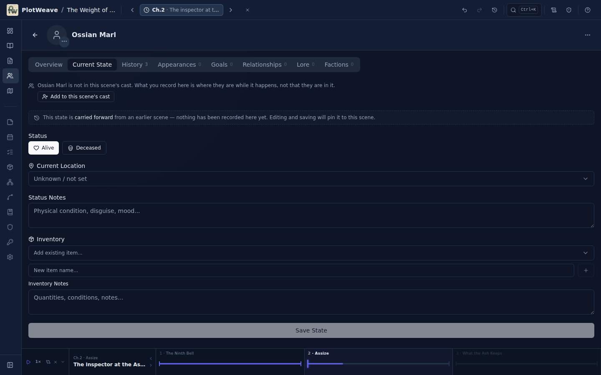

**Then I tried to delete the stray record and could not.** The History tab lists the
snapshots and lets you click one to move the cursor there; there is no delete on the
card, none on hover, and the character's `⋯` menu contains exactly one item: *Delete
character*.

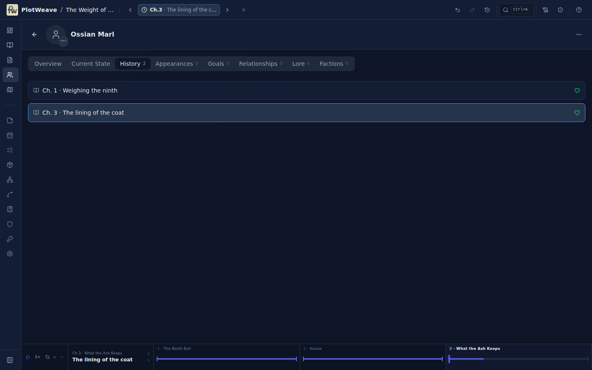

**Mechanism.** `deleteSnapshot` exists and is unit-tested
(`src/db/hooks/useSnapshots.ts:211`, `src/db/hooks/__tests__/snapshots.test.ts:95`),
but nothing in `src/` calls it — `grep -rn "deleteSnapshot" src --include=*.tsx`
returns zero hits. The data layer can do it; the UI has no door to it.

**What it costs.** The only repair available is to write *another* assertion you do
not mean ("he is at the Ash Foundry in this scene") at every scene the stray record
poisons. And you have to notice first: nothing distinguishes "Unknown because I never
said" from "Unknown because a record here says so" unless you read for the absence of
the carried-forward note.

**Fair qualification.** *Save State* is disabled until the form is dirty, so this
needs a wrong cursor *plus* a real edit — it is not a stray click. But the app
actively invites recording state for characters who are not in a scene (*"What you
record here is where they are while it happens, not that they are in it"*, plus an
*Add to this scene's cast* button), so writing off-stage records is a supported,
encouraged action. I made it twice in one morning on one character (Ossian Marl's
History tab ends the session showing two empty records at scenes he is not in),
without ever intending to record anything about him.

---

### N2 — Typing the name of an item you already have creates a second item, silently
**Severity: high.** *Observed, reproduced three times, mechanism cited.*

**What I did.** Cathe Vaux → Current State → typed `The tally-slate` into the field
labelled **New item name…** → pressed `+` → *Save State*. `The tally-slate` already
existed, with a description I had written.

**What I expected.** Either the existing item, or a warning.

**What happened.** A second, blank item record with the identical name.

```
BEFORE: ["Cathe’s letter","The ninth bell","The tally-slate"]
AFTER:  ["Cathe’s letter","The ninth bell","The tally-slate","The tally-slate"]
```

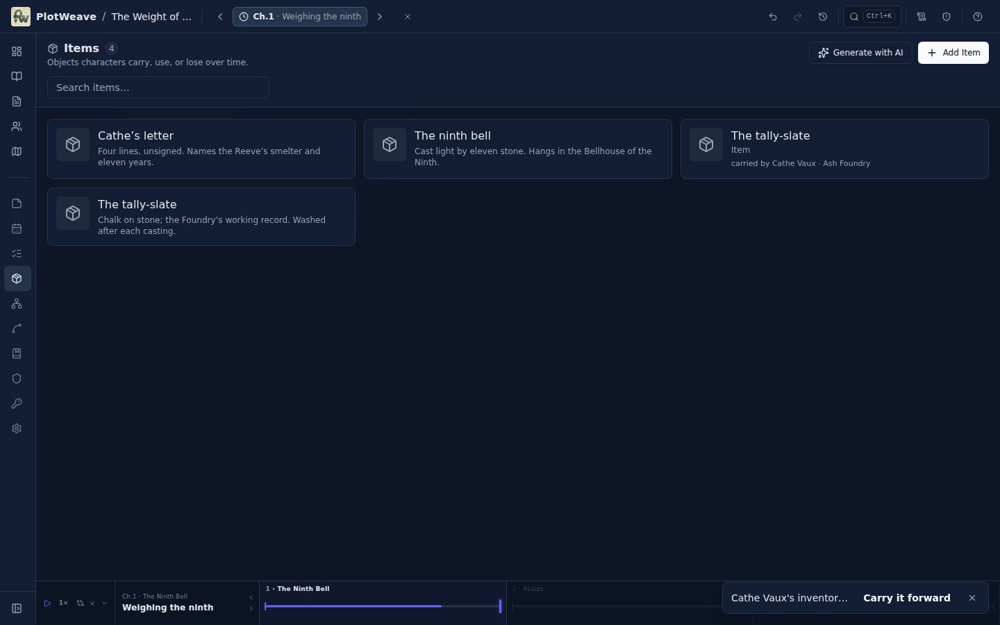

No warning appears while typing the colliding name, and none on save
(`/already exist|duplicate|same name/i` matched nothing in the panel's text):

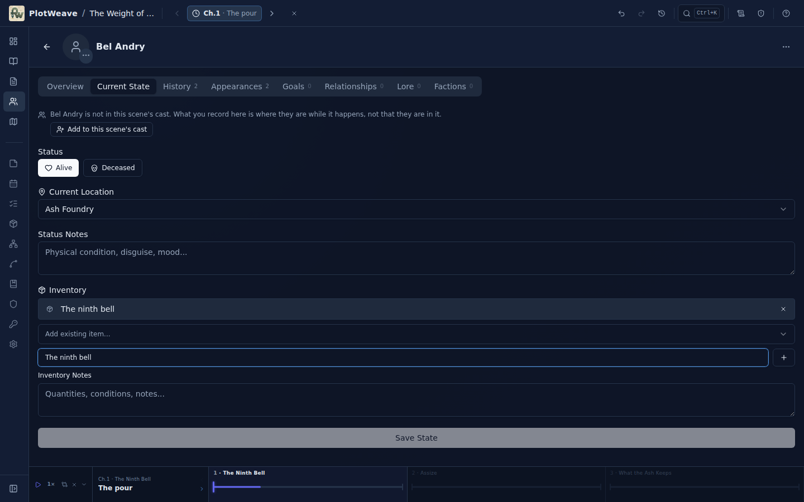

Earlier in the session I did this three times with *Cathe's letter* without noticing,
and ended up with **four** item records of that name in the catalogue, only one of
which had my description. Item counts went 6→7 and 7→8 on the two runs I measured.

**Mechanism.** `src/features/characters/tabs/CurrentStateTab.tsx:343-354`:

```ts
async function addNewItem() {
  if (!newItemName.trim()) return
  const item = await createItem({ worldId: character.worldId, name: newItemName.trim(), … })
  mark(() => setInventoryIds((ids) => [...ids, item.id]))
```

`createItem` unconditionally, with no lookup against `items`, which is already in
scope two lines above where the *Add existing item…* select is built.

**Why it is worse than a tidy-up chore.** The app's hand-off logic is genuinely good —
`save()` removes an item from whoever else held it and offers a *"(transfer from
other character)"* row in the picker — and the continuity checker has a `dup-item`
rule for one object in two places. **Both key on item id.** Two records called *The
tally-slate* are two objects as far as the app is concerned, so a writer who types
names instead of picking them gets silence from exactly the machinery they installed
the app for. I could not make `dup-item` fire at all through the UI, precisely
because the correct paths all deduplicate and the incorrect path creates a second id.

**The correct control is right there**, immediately above the free-text field, and it
works well — I used it for the letter's hand-off from Perrin to Isquel and the app
took the letter off Perrin correctly, including across a chapter boundary. The
problem is that the wrong field looks like the primary one and fails without a sound.

---

### N3 — Deleting an item leaves its id in every inventory, printed raw
**Severity: medium-high.** *Observed, reproduced cleanly, mechanism cited.*

**What I did.** Gave Ossian Marl a new item (*Reeve's seal*) at Ch.1 *Weighing the
ninth*, saved, then deleted that item from the Items screen. The confirm dialog says:

> Delete "Reeve's seal"? **This will permanently remove the item and all its
> snapshots.**

**What I expected.** It gone from his inventory.

**What happened.** His inventory shows `v0kl_JqZAhw0iArJxkoN0`.

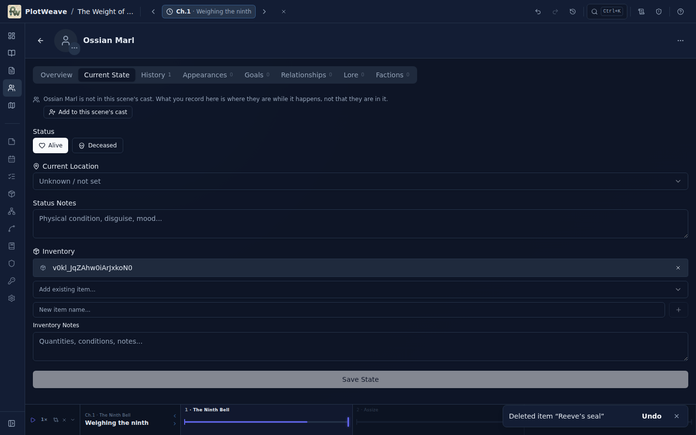

In the **History** tab the same dangling reference renders as a bare item icon with
*no text at all* — invisible rather than merely ugly.

**Mechanism.** `src/db/hooks/useItems.ts:36-42` cascades `itemPlacements` and
`itemSnapshots` and never touches `characterSnapshots.inventoryItemIds`. The display
falls through to `{item?.name ?? itemId}`
(`src/features/characters/tabs/CurrentStateTab.tsx:508`).

**The pattern already exists in this codebase and was not applied here.**
`src/db/hooks/useLocationMarkers.ts:86-95` does the analogous cleanup, with a comment
explaining why:

```ts
// Null out stale currentLocationMarkerId references (currentLocationMarkerId is unindexed — filter scan)
await db.characterSnapshots.filter((s) => s.currentLocationMarkerId === id)
  .modify({ currentLocationMarkerId: null })
```

That makes this cheap to fix and makes the confirm dialog's wording currently untrue.

**Compounding with N2.** The natural way to discover you have four items called
*Cathe's letter* is to delete three of them — which is what I did, and which is how I
found this. The two bugs meet on the most likely repair path.

---

### N4 — Twelve consecutive rows of "Added knowledge reveal"
**Severity: medium-low.** *Observed, mechanism cited.*

After recording twelve knowledge reveals, **Recent changes** shows twelve rows that
cannot be told apart:

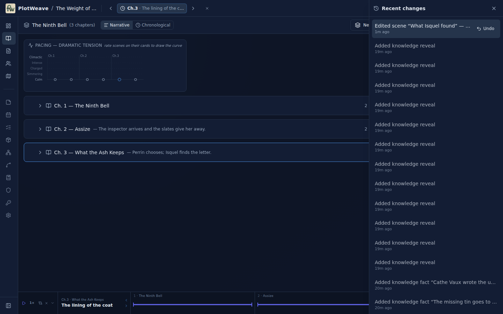

Knowledge *facts* on the same list name themselves — *Added knowledge fact "Cathe
Vaux wrote the u…"* — so the naming machinery works; reveals fall through it.

**Mechanism.** `KnowledgeReveal` (`src/types/knowledge.ts:26-35`) has no `name`,
`title` or `label`, so `recordName()` returns null; and `knowledgeReveal` is absent
from `SUBJECT_OWNER` (`src/lib/operationSubject.ts:45-52`), which is the exact
mechanism written to solve this problem for snapshots. A reveal has both a `factId`
and a `characterId`, so *"Perrin Vaux learns 'Cathe Vaux wrote the unsigned letter'"*
is reachable with the code that is already there.

This matters because the panel is where you decide what to take back. Undo is linear
and only the top row carries the button, so a list of identical rows is a list you
cannot navigate by.

---

### N5 — Places must be pins on a map before a scene can have a setting
**Severity: medium-low as shipped.** *Observed. Design constraint, not a defect.*

There is no Locations screen in the nav. Going to **Maps** with no map yet:

> Places in PlotWeave are pins on a map, so a scene can only be given a setting once
> the world has one.

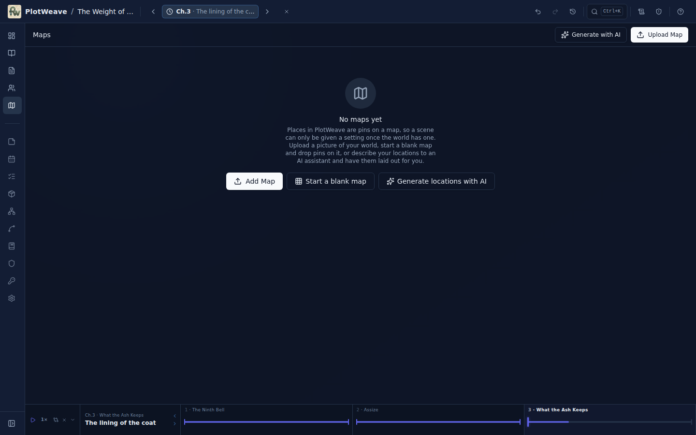

(`src/features/maps/MapExplorerView.tsx:1362`.)

**Cost to me:** three clicks (*Start a blank map* → *+ Location* → click the canvas)
and then a named pin on a grid, which was fine. **Cost to a writer who does not think
spatially:** they are told, at the moment they first want to say "this happens in the
kitchen", that their world needs a map. Some will stop there.

I am flagging this as *low* because the escape hatch is present, one click away, and
named plainly — and because the payoff is real: once places exist, the Writer's Brief
and the continuity checker can answer *where*, which is half of what I came for. But
the empty state currently reads as a rule rather than as an offer.

Every location I created was also silently typed **City** by default, including a
foundry and a bell tower.

---

### N6 — The chapter screen cannot rename its chapter
**Severity: low.** *Observed.*

On `/timeline/:chapterId`, the heading *Ch. 1 — Chapter 1* is static text. Clicking
it does nothing; there is no `⋯` menu in that header. Rename lives only on the
chapter's row back on `/timeline`: **Back → find the row → ⋯ → Rename chapter**.
At 117 chapters (below) "find the row" is not free.

---

### N7 — Search matches inside words
**Severity: low.** *Observed.*

`Ctrl+K` → `tin` returned 5 results. One was *Rain on the tally-house*, whose snippet
contains no `tin`:

> …kept until the next cas**tin**g, then washed. Two hundred years…

Likewise `Bel` matched *Bellhouse*, *bell*, *bells* alongside *Bel Andry*. There is
no whole-word option in the palette, though **Find & replace** has one. For a fantasy
writer with short invented names this is real noise; for everyone else it is a
shrug. Otherwise search is excellent (see below).

---

### N8 — 117 chapters is 8,055 px of scrolling with no jump-to-chapter
**Severity: low, well mitigated.** *Measured.*

On the imported *Monte Cristo*:

```
rows: 117   scrollHeight: 8055px   clientHeight: 739px
```

Eleven screens to reach the last chapter. There is no chapter index, no collapse-all,
no jump control in the timeline header. **But** `Ctrl+K` → *"Shot Sounds"* → `Enter`
landed me on `timeline/…-chapter-092` *and set the time cursor to that scene*, in a
measured 4.3 s including my typing. The escape hatch is good enough that I am
recording this as an observation rather than a complaint.

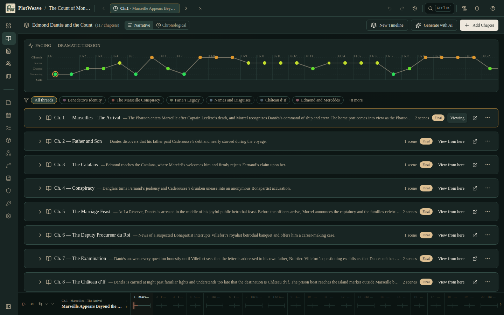

---

### N9 — Small things I noticed and did not chase
*Observed, low confidence that any is worth acting on.*

- The world card in the picker shows **Created Aug 25, 2026**, not last-edited. For a
  returning writer with several worlds, "when did I last touch this" is the more
  useful line. (The dashboard's *Recently edited* covers it once you are inside.)
- The world title is truncated to *"The Weight of …"* in the top bar at 1440 px with
  roughly 800 px of empty space beside it.
- On the dashboard, two of the three nudge banners have a dismiss `✕`; *"Define how
  your characters relate"* does not.
- The **Timeline** devotes ~185 px at the top to a pacing chart that, on a new world
  with one unrated scene, shows a single grey dot.
- On the character roster, characters with no snapshot say *"No state recorded at this
  moment"*; a character with an empty snapshot says nothing at all — a blank line
  where the other cards have text.
- The *Open chapter detail* control on a timeline row is an unlabelled icon whose
  accessible name comes only from its `title` attribute.

---

## What I only suspect

Kept separate on purpose. Each of these is a guess; I say what would settle it.

**S1 — The `dup-item` continuity rule may be unreachable through the UI.**
`src/lib/continuity/computeIssues.ts:676-720` groups snapshots by `eventId` and flags
an item in two inventories at one scene. I tried four times to make it fire and
failed every time, because `save()` (`CurrentStateTab.tsx:299-310`) removes the item
from the previous holder whenever you pick it from the *Add existing item…* list, and
the free-text field creates a *different* id (N2). *What would settle it:* find the
write path that can put one `itemId` into two `CharacterSnapshot.inventoryItemIds`
rows at the same `eventId` — world import and AI generation are the candidates — and
check whether the rule then fires. If no such path exists, the rule is dead code and
the *real* duplicate-item risk is N2, which nothing checks.

**S2 — The same "unnameable operation" gap as N4 probably affects other entities.**
`OperationEntity` also includes `factionMembership`, `factionRelationship`,
`characterMovement` and `timelineRelationship`, none of which are in `SUBJECT_OWNER`
and none of which obviously carry a `name`/`title`/`label`. *What would settle it:*
create one of each in a world and read the Recent changes rows. I did not, because my
book has no factions.

**S3 — Cold-launch may drop an Electron user at the world picker.**
`page.goto('http://localhost:4173/')` with no hash lands on the world selector even
though `activeWorldId` is in `localStorage`; a `reload()` (which keeps the hash)
restores the world correctly. In the browser this is correct behaviour and my own
early confusion was an artifact of my script. But `electron/main.cjs` loads
`index.html`, which has no hash, so every desktop launch may be the no-hash case.
*What would settle it:* run `npm run electron:dev`, open a world, quit, relaunch. I
did not test Electron.

**S4 — A "Replace all" is one click from damage.**
Find & replace on `forty-one` matched two scenes: Isquel's age, which I meant, and
*"Two hundred and forty-one"*, the bell's weight, which I did not. I clicked
**Replace all** and corrupted a plot point. This is *probably not a bug* — the dialog
lists every match with surrounding context and gives each its own **Replace** button,
which is exactly the right design, and the footer tells you recovery exists. I am
listing it only because *Replace all* has no confirmation step and sits at the bottom
where a return key can find it. *What would settle it:* whether real users reach for
per-match Replace or for Replace all. I reached for the wrong one.

**S5 — Was my "the @ mention leaves a sigil in the prose" observation.** It was
wrong, and I am recording the correction because it is the sort of thing that gets
filed confidently. I saw `@Perrin Vaux` in my compiled manuscript and nearly wrote it
up. The `@` was residue from an earlier aborted test of mine. Re-run cleanly, the
picker inserts the plain name and adds a **Mentioned** chip to the scene:

```
TAIL: "…someone was drawing water.\n\nShe went down into the yard to find Perrin Vaux "
scene chips: … MENTIONED | Perrin Vaux | + Mention character…
```

`SceneDraftEditor.tsx:142-153` is explicit about it — *"a manuscript should not carry
@tokens"*. The feature is correct.

---

## What worked

This section is not a courtesy. Several of these are load-bearing and a future change
could easily undo them.

**The Writer's Brief is the product.** One click, at any cursor position, from any
screen: the chapter, the active scene and its setting, every character with their
location, status note and inventory, a *carried forward* badge separating what you
recorded from what the app inferred, and **Knowledge in the room** listing who knows
each secret by now. This answered two of my three questions with a single click and
no navigation. If one thing in PlotWeave has to survive a redesign, it is this panel
and the *carried forward* badge on it.

**The continuity checker earns its place, and it is actionable.** On my own book it
found two things I had genuinely got wrong — Bel Andry and Cathe Vaux are named in
the prose of *The pour* but were not in its cast — with the count of appearances, an
explanation of the difference between *mentioned* and *present*, and a one-click fix.
I fixed them properly and it went to *No issues found*. On the 117-chapter Monte
Cristo it produced **28 observations and 6 warnings in 1,368 ms**, including *"Edmond
Dantès knows 'Haydée possesses proof against Fernand' before it happens — isn't true
until Ch. 77, but he knows it in Ch. 49"*, and every dead-character finding carried
*"Mark as Flashback if intentional"* rather than insisting.

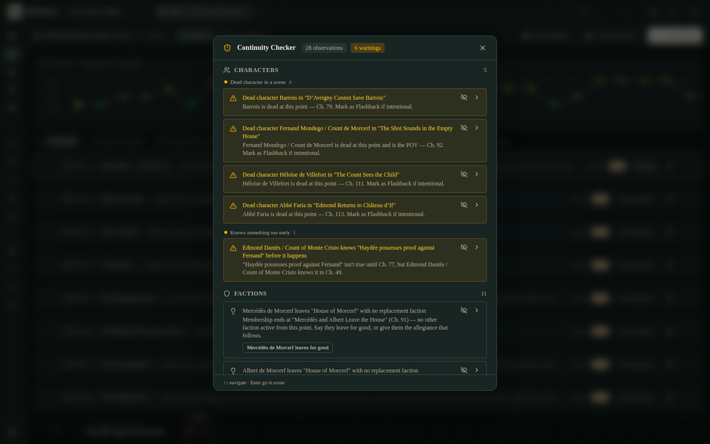

**Scene history with a word-level diff, and Restore.** I destroyed a plot point with
a careless replace and got it back: a timestamped version list, a red/green diff
against current, a confirmation that says *"The current prose will be saved as a new
version first, so you can undo this"*, and a restore that worked. Round trip
including my mistake: under two minutes.

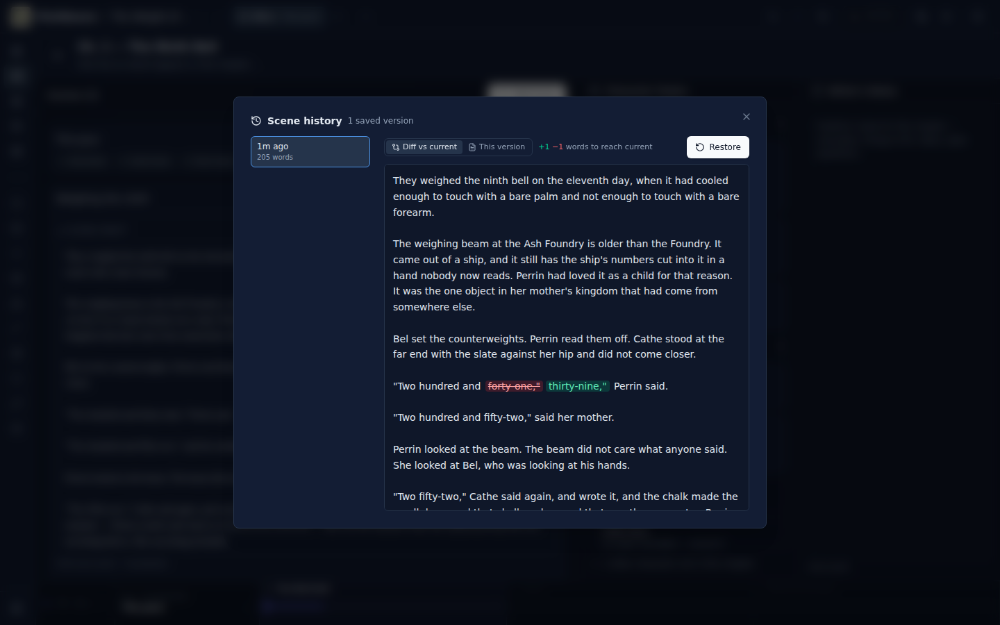

**Undo is real and it names what it will undo.** The top-bar tooltip read *"Undo:
Added location 'Bellhouse of the Ninth' (Ctrl+Z)"*. When I deleted the wrong item by
accident it came back intact, with a toast offering *Undo* at the point of the
deletion.

**Knowledge tracking is the best-designed screen in the app.** Per-fact: who knows,
in which scene, when it *becomes true*, and when the *reader* learns it — with a
separate control for that last one, which is a distinction most tools do not make.
The counts on the cards are cursor-relative and say so. And **MIGHT ALSO KNOW** is
genuinely clever: it noticed *Bel Andry — with Cathe Vaux in Ch. 1* and offered
*+ learned it*.

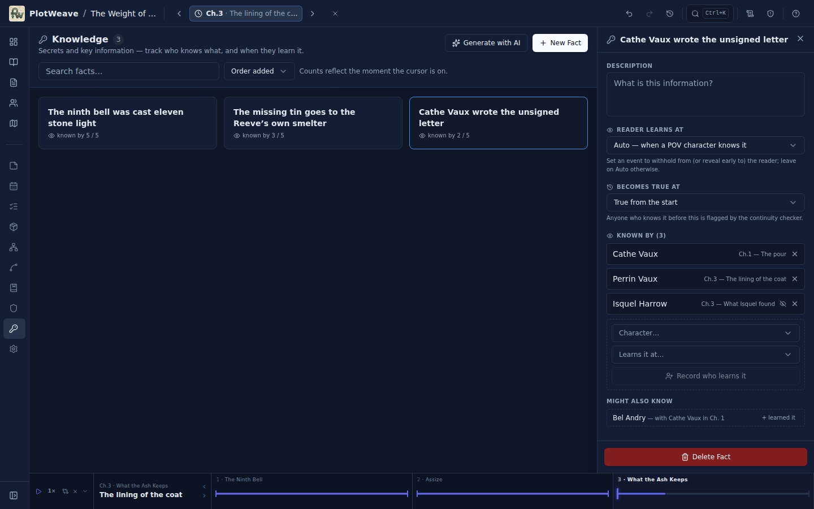

**It is fast, and it stays fast.** Cold document load to content, measured with
content-anchored waits on the 117-chapter / 149-scene / 41-character import:

| Screen | Time to content |
|---|---|
| Timeline (all 117 chapter rows present) | **914 ms** |
| Characters roster (41) | **651 ms** |
| Manuscript | **679 ms** |
| Continuity checker (full run) | **1,368 ms** |
| Search palette open + query | ~1.5 s |

Nothing in this app made me wait.

**Writing in it is pleasant.** The scene draft box auto-grows to hold the whole scene
(291 words rendered without a scrollbar), autosaves with an honest label (*"Draft
auto-saved · 9 paragraphs"*), and **Focus** gives a real distraction-free editor:
serif, generous leading, an ~80-character measure, live word count, *Esc to exit*.

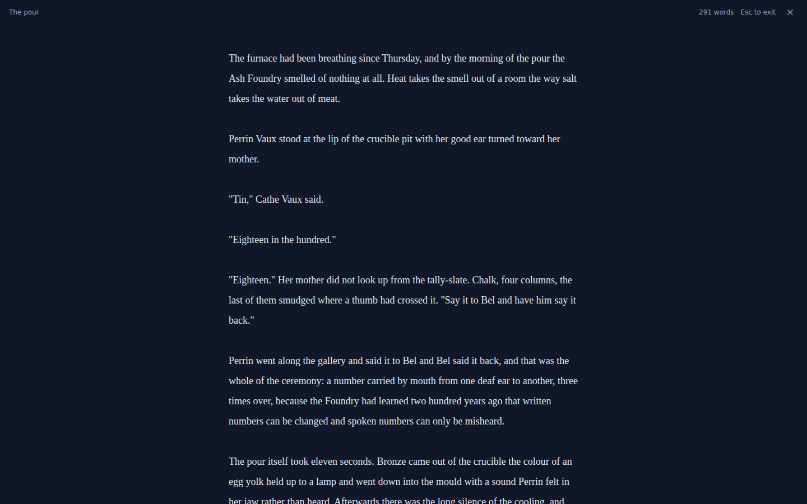

**The manuscript is a manuscript.** Chapter headings, indented paragraphs, scene
breaks, per-scene word counts, a Draft/Reading toggle, and export to Markdown, HTML,
plain text, Word and EPUB with *Include chapter titles* / *Only written scenes*
switches and a word count in the dialog. The `.md` I exported was clean and
publishable-looking on the first try.

**Search is cross-entity and shows you the answer.** One palette covers characters,
items, locations, chapters, scene prose and knowledge facts, with the match
highlighted in context. Twice it answered my question without my opening anything.

**The first-run wizard is well judged.** Four steps, plain language (*"Your story
begins with a moment"*), a collapsed optional description so the step stays light, an
always-visible *Skip and explore on my own*, and it ends by explaining the time
cursor — the one concept the whole app rests on — at the moment you first have
something to point at.

**The Library is one click, not a file round trip.** I misread *Download (703 KB)* as
a file download; it imports the world straight in, and puts it under a separate
**READING** heading with a *Chapter 1 of 117* progress bar, distinct from **YOUR
WORLDS**. Reading mode was on by default with an honest banner — *"You are reading up
to chapter 1, so 39 characters, 49 places and 16 items you have not met stay hidden
until you reach them"* — and two clear buttons. That is a thoughtful feature I did
not expect to find.

**Coming back works.** Cold browser, `localhost:4173`, click the world: the time
cursor was exactly where I left it (Ch.3 · *What Isquel found*) and the dashboard's
*Recently edited* list showed my last five scenes in order.

---

## Verdict

**Is this a real help to a writer, or does it mostly give them more work to do?**

It is a real help, and it is not close — *provided the writer has already decided
that continuity is a problem they have.*

The honest way to put it is that PlotWeave asks for a specific, non-trivial payment
and then pays it back at a good rate. The payment is per-scene state: for the Writer's
Brief to tell you where Perrin was, somebody has to have told it, one scene at a time,
through a form. In my session that was eight records for five characters over six
scenes, at roughly six interactions each. The return was that three questions which
would each cost ten minutes of scrolling through a manuscript cost about twenty
seconds combined, and that a continuity checker found two real errors in 1,354 words
— errors I had made that morning and did not know about.

That trade is excellent at 1,354 words and it gets *better* as the book grows, because
the cost is linear in scenes and the benefit is quadratic in things-that-can-contradict.
The 117-chapter import ran every screen in under a second and the full checker in
1.4 s, so the machinery does not fall over at the scale where it matters most.

**Who it helps.** Writers of long, populous, multi-thread books where somebody's
whereabouts, an object's custody, or who-knew-what-when is load-bearing plot. Fantasy
and mystery above all — the knowledge model is built exactly for the "who knew by
then" question, and I have not seen it done this well elsewhere. Writers who revise
heavily, because find & replace with per-match context plus word-level scene history
plus undo makes a large edit recoverable. Writers who are coming back to a draft after
a break, because the dashboard and the restored time cursor put you back where you
were.

**Who it does not help.** Anyone writing a short, small-cast, single-location book:
the bookkeeping will cost more than it returns, and they should use the manuscript
view and ignore two-thirds of the nav. Anyone who wants a *drafting* tool first — the
prose surfaces are good but the app's centre of gravity is the story bible, not the
page. Discovery writers who resist committing to facts will find that every record is
an assertion at a specific scene, and that the app has no gentle way to un-assert one
(N1).

**What the judgement depends on.** Three things, in order.

1. **Whether a wrong record can be taken back.** Today it cannot (N1), and because
   the model is delta-based, one wrong record does not sit quietly — it silently
   erases everything downstream of it. This is the single change that would most
   improve the app, and the function to do it already exists and is tested.
2. **Whether the entity catalogue stays trustworthy.** N2 and N3 both attack the same
   thing: after a morning of ordinary use my Items list had four records called
   *Cathe's letter* and one character's inventory was displaying a raw nanoid. A
   story bible whose catalogue is quietly wrong is worse than no story bible,
   because you stop checking.
3. **Whether the Writer's Brief keeps its *carried forward* badge.** Everything good
   here rests on the writer being able to tell what they said from what the app
   inferred. That distinction is currently surfaced in three places — the brief's
   badge, the Current State panel's carried-forward note, and the item Whereabouts
   chain — and it is the thing that makes the delta model legible instead of spooky.

Fix N1 and N2 and I would recommend this to a novelist without qualification. As it
stands I would recommend it with one sentence of warning: *be careful which scene the
cursor is on before you press Save, and always pick items from the list rather than
typing their names.*

---

### Appendix — how this was run

Production build served with `vite preview` on `:4173`, driven from a scratch
directory with `@playwright/test` and a persistent Chromium profile
(`/opt/pw-browsers/chromium`) so that "leaving and coming back" was a genuine cold
start rather than a page reload. The profile was created empty; an earlier run's
IndexedDB was found in the default scratch path and discarded before starting, so
"start from nothing" means nothing. Nothing under `src/` was modified. Timings are
wall-clock from `page.goto` to a content-bearing selector, taken once each; they are
indicative, not benchmarks. Screenshots referenced above are in
`docs/images/writer-run-2026-08-25/`.
